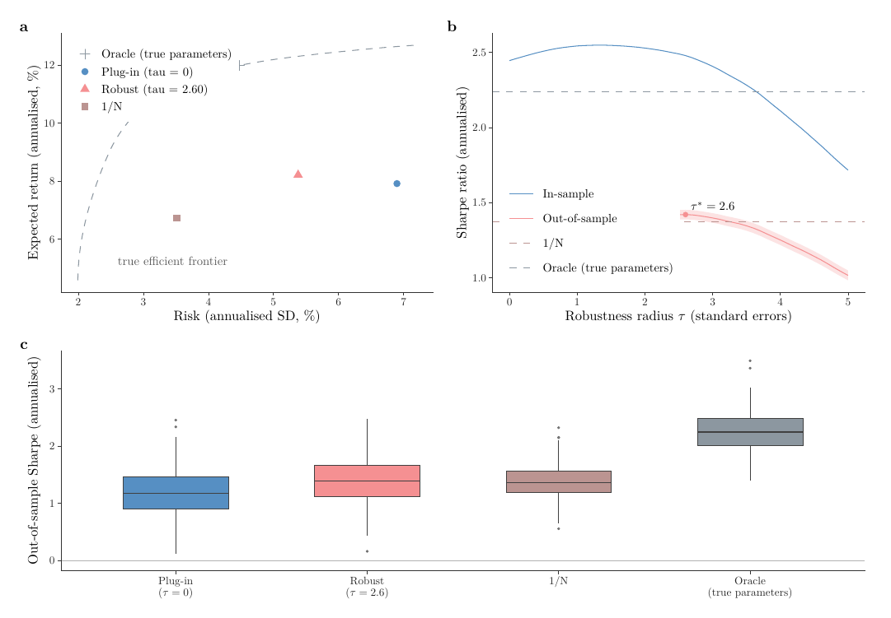

论文里插图的痛点从来不是画不出来，而是**画出来的图和正文不是一套东西**：PNG 缩放会糊，PDF 里的字体和正文不同源，图里的 $\tau$、$\sigma$ 和正文里的数学符号字形对不上，改一次正文字号又得回头重出一遍图。

`tikzDevice` 把这个问题一次性解决：它让 R 的绘图指令**输出成 TikZ 代码**，由 LaTeX 去排版。于是图里的文字就是正文的字体，公式就是正文的数学模式，图的宽度跟着 `\linewidth` 走，放大到任意倍数都不失真。



## 三套方案，按需求挑

| 方案 | 引擎 | 中文标签 | 适合 |
|---|---|---|---|
| **A｜tikzDevice + XeLaTeX + xeCJK** | `xelatex` | ✅ | 中英文混排的论文插图（本文推荐） |
| **B｜tikzDevice + pdfLaTeX** | `pdflatex` | ❌（仅英文/公式） | 纯英文投稿，配置最省事 |
| **C｜cairo_pdf / ragg 出 PDF** | — | ✅ | 只想快速交一张矢量图，不在乎字体是否随正文变化 |

方案 C 其实不涉及 tikz，但值得摆在一起做对照：它出的是**已经排好版的 PDF**，插进文档里字体不会再变；而 A/B 出的是**代码**，最终字体由论文自己决定（`\input` 进正文后，图里的字就是正文字号与字体）。中文图如果一时调不通，C 是最稳的退路。

## 方案 A：可复制的最小配置

核心只有一条：**把度量阶段的宏包换掉**。

```r
library(tikzDevice)

xelatex <- "C:/texlive/2026/bin/windows/xelatex.exe"   # 换成自己的路径
cjk <- c("\\usepackage{xeCJK}",
         "\\setCJKmainfont{SimSun}",                    # 宋体：正文
         "\\setCJKsansfont{Microsoft YaHei}")           # 微软雅黑：无衬线

options(
  tikzLatex   = xelatex,        # tikzTest()/回退路径也走 xelatex
  tikzXelatex = xelatex,
  # 关键：度量文档里不能出现 \usepackage[T1]{fontenc}（xetex 下与 xeCJK 冲突），
  # 但要自己补上 tikzDevice 默认带的 calc 库
  tikzMetricPackages  = c(cjk, "\\usetikzlibrary{calc}"),
  tikzXelatexPackages = c("\\usepackage{tikz}", "\\usepackage{xcolor}",
                          "\\usepackage{amsmath}", cjk)
)

tikz("fig1.tex", width = 6.8, height = 3.0, standAlone = FALSE, engine = "xetex")
print(p)          # p 是 ggplot 对象；基础图形则直接写绘图调用
dev.off()
```

`standAlone = FALSE` 只产出 `tikzpicture` 片段，外层再套一个自己的壳去编译：

```latex
% fig1.wrapper.tex
\documentclass[border=2pt]{standalone}
\usepackage{xeCJK}
\setCJKmainfont{SimSun}
\setCJKsansfont{Microsoft YaHei}
\begin{document}
\input{fig1.tex}
\end{document}
```

```powershell
xelatex -interaction=nonstopmode fig1.wrapper.tex   # → fig1.wrapper.pdf
```

论文里两种用法都行：**`\input{fig1.tex}`**（推荐，字体完全跟随正文）或 `\includegraphics{fig1.wrapper.pdf}`（拿来即用）。

## 四个坑，以及它们真正的根因

| 报错 | 根因 | 处理 |
|---|---|---|
| `! Missing \endgroup inserted.` 紧接着 `Undefined control sequence. l.26 \path` | TikZ 度量字符宽度时会生成一个临时文档，里面 tikzDevice 自带的 `\usepackage[T1]{fontenc}` 与 `xeCJK` 在 XeLaTeX 下冲突 | 用 `tikzMetricPackages` 把它换成 `xeCJK` 那几行 **＋** `\usetikzlibrary{calc}`（别忘了 calc） |
| `Critical Package xeCJK Error: The xeCJK package requires XeTeX to function.` | 度量/自检阶段回退到了 `pdflatex` | `options(tikzLatex = xelatex, tikzXelatex = xelatex)`，并 `tikz(engine = "xetex")` |
| 宽图右侧被裁掉，页面却是整页 Letter | `standAlone = TRUE` 用的是 `article` 类，不紧贴内容 | 改成 `standAlone = FALSE` + 自写 `standalone[border=2pt]` 外壳 |
| `TeX was unable to calculate metrics for: \char-964` | 用了 R 的 plotmath（`expression(paste(..., tau, ...))`），tikzDevice 把 $\tau$ 转成了 `\char-964` | **不要用 plotmath**，标签写成字符串 + LaTeX 数学 |

四个坑里只有一个是真的“中文问题”（第一个），其余三个纯英文图同样会遇到——所以方案 B 也建议照抄 `tikzMetricPackages` 那一行（把 `xeCJK` 去掉即可）。

## 标签写法速查

默认 `sanitize = FALSE`，标签按 LaTeX 规则手写：

| 想要 | 写法 |
|---|---|
| 百分号 / 下划线 | `"\\%"`、`"\\_"` |
| 希腊字母 | `"$\\tau$"`、`"$\\sigma$"` |
| 上下标 | `"$\\tau^{*}$"`、`"$\\sigma^2$"` |
| 中文 | 直接写（走 `xeCJK`） |

只有一处例外：标签里既有中文又有一堆 `% _ & #` 又不想逐个转义时，可以临时 `sanitize = TRUE`——但这时**不能再用数学模式**，两者不可兼得。

## 排版参数建议

- **宽度**：先量出正文文本宽度（`\showthe\linewidth`，A4 + `ctex` 单栏约 3.3 in，双栏一栏约 3.3 in，整幅跨栏 5.5–7.0 in），R 里 `width` 就填这个英寸数，图里的字号才会和正文一致
- **高度**：按内容定，别硬凑比例；`standalone` 会自动裁到内容边界
- **字号**：不要在图里手写字号（`base_size = 14` 之类），让它继承正文；需要强调时用 `theme(text = element_text(size = ...))` 微调相对大小
- **多面板**：`patchwork` 拼好后整块交给 `tikz()`，面板标签 a/b/c 用 `plot_annotation(tag_levels = "a")`

## 出图后的四项自检

1. R 端有没有报度量错误（有 → 回到上面那张根因表）；
2. `pdfinfo fig1.wrapper.pdf` 的 Page size 是否等于图尺寸（英寸 × 72）——不等就是被裁了；
3. 编译日志里 `Missing character` 计数是否为 0（不为 0 → 那个字符没进字体，改成 LaTeX 数学模式或换字体）；
4. `pdftotext fig1.wrapper.pdf -` 能不能抽出文字——能抽出来说明字体已正确嵌入。

## 环境（本文实测）

R 4.6.1 + ggplot2 4.0.3 + patchwork 1.3.2、`tikzDevice` 0.12.6、TeX Live 2026（`xelatex` 与 `xeCJK`）、Windows 11。同一套配置在纯英文图（方案 B）上把 `xeCJK` 那两行删掉即可直接复用。

一句话总结：**图交给 R 画，排版交给 LaTeX 做**——把 `tikzMetricPackages`、`engine = "xetex"`、`standAlone = FALSE` 这三处配置对，中文论文插图就能和正文长成一家人。
