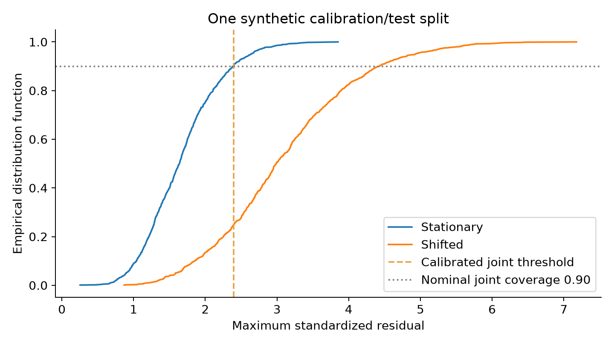
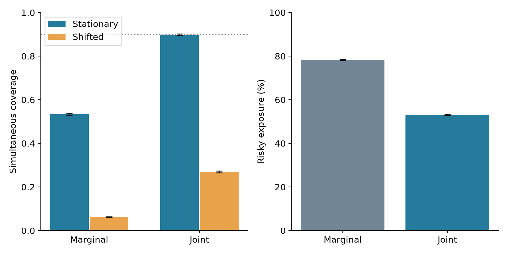

共形预测（conformal prediction）提供预测集合的有限样本覆盖结论，但覆盖不是收益保证，也不自动等于组合的风险约束。当优化器根据多个资产的预测区间挑选权重时，逐资产的边际覆盖与整个收益向量的同时覆盖之间存在关键差异。本文构造同时共形集合，并将其最坏情形损失转化为配置约束；主要结论是，同时校准可以支撑选择后的单期损失界，但在合成实验中显著降低风险敞口，分布漂移则使原有覆盖保证失去适用基础。

近期研究展示了将预测区间用于仓位规模的尝试。Ryan 的 2026 年 Conformal Kelly 预印本尤其值得完整阅读：论文报告开发窗口中的表现，同时明确说明预注册后续窗口的增长优势没有延续。因此，本文不会把预测区间的经验覆盖与投资收益改善混为一谈，也不从开发期结果推导一种稳定盈利规律。[2026 年预印本](https://arxiv.org/abs/2608.01494v1)

理论研究则继续澄清覆盖所需的概率结构。Barber 等人分析非交换数据下的覆盖误差；Tibshirani、Barber 与 Ramdas 的 2026 年预印本从交换性检验角度重新组织共形预测的基础结果。这些研究提示一个有价值的组合优化方向：先写清楚需要控制哪个随机事件、决策在何时选择、数据满足何种依赖结构，再讨论具体校准器。[非交换性研究](https://doi.org/10.1214/23-AOS2276)；[2026 年理论预印本](https://arxiv.org/abs/2608.27310v2)

## 问题设定

设收益向量为 $R\in\mathbb R^N$，预测均值为 $\widehat\mu$，每个资产的预测尺度为 $\widehat\sigma_i>0$。这些预测器必须在校准之前固定，或通过与校准集独立的训练集拟合。本文实验直接给定预测均值与尺度的真值，以便隔离校准结构的影响，避免模型训练误差与覆盖误差同时变化。

普通逐资产区间可写为 $[\widehat\mu_i-q_i\widehat\sigma_i,\widehat\mu_i+q_i\widehat\sigma_i]$。若各区间都有至少 $1-\alpha$ 的边际覆盖，这只约束每一个资产单独落入区间的概率。在六个独立且精确覆盖为 0.9 的资产上，全部资产同时进入各自区间的概率仅为 $0.9^6\approx0.531$。这不是共形方法的失效，而是研究者把边际结论误读成向量结论。

目标是为未来的单期组合损失 $\ell(w,R)=-w^{\top}R$ 提供上界。若包含收益为零的现金，风险资产权重合计可以小于一，其余部分持有现金。本文所说的风险约束针对一期损失超过给定阈值的事件，既不是最大回撤，也不是跨期累计亏损概率，更不等价于条件风险价值。

## 方法

### 同时校准的有限样本构造

对 $n$ 个校准收益向量，定义共同非一致性分数（nonconformity score）

$$
S_k=\max_{1\leq i\leq N}
\frac{|R_{k,i}-\widehat\mu_i|}{\widehat\sigma_i},
\qquad
j=\left\lceil(n+1)(1-\alpha)\right\rceil.
\tag{1}
$$

令 $q$ 为 $S_1,\ldots,S_n$ 中第 $j$ 个次序统计量；若 $j>n$，约定 $q=+\infty$。本文 $n=200$、$\alpha=0.1$，因此 $j=181$。在校准数据与新收益交换、预测器事先固定且分数对各样本一致处理时，分割共形（split conformal）集合

$$
\mathcal C=\{r: |r_i-\widehat\mu_i|\leq q\widehat\sigma_i,
\ i=1,\ldots,N\}
\tag{2}
$$

满足 $\Pr(R_{n+1}\in\mathcal C)\geq1-\alpha$。这里的概率通常同时平均校准样本和新样本的随机性，是边际有限样本结论；它并不保证每一个固定校准集都恰好达到 90% 覆盖，也不保证任意给定市场状态下的条件覆盖。对连续分数，次序统计量的离散化误差有明确来源，不应以经验分位数的插值替代所需秩校正。

逐资产校准的另一条可行路径是给第 $i$ 个区间分配 $\alpha_i$，满足 $\sum_i\alpha_i\leq\alpha$，再由联合界获得同时覆盖。这通常比较保守，但保证结构清楚。最大分数校准直接利用校准收益向量的共同分布，可在某些相关结构下缩小区间；两种方法谁更窄取决于尺度、尾部与资产依赖，本文不提供普遍比较定理。

### 从收益集合到组合损失界

对于任意给定权重，式 (2) 的线性最坏情形损失为

$$
\sup_{r\in\mathcal C}[-w^{\top}r]
=-w^{\top}\widehat\mu+q\sum_i|w_i|\widehat\sigma_i.
\tag{3}
$$

因此可在组合优化中施加式 (3) 不超过阈值 $B$ 的约束。即使 $w$ 是看到校准集后才选择，只要其满足这一约束，那么在共同事件 $R_{n+1}\in\mathcal C$ 上，损失界对所有可行权重同时成立。这是同时集合对选择后决策的价值：先为整个收益向量建立覆盖事件，再在该事件内保障任意被选中的可行组合。

相反，只对已经选中的某个资产套用其原始边际区间，容易把选择步骤遗漏掉。若选择模型、分数定义或资产池也根据同一校准集反复调优，原先的交换排名证明不一定保留。可采用独立选择集、预先确定的资产池，或明确处理多重选择的同时校准程序；不能依靠把样本量写大就自动消除选择偏差。

需要特别区分期望风险控制。Angelopoulos 等人的 Conformal Risk Control 研究对单调损失的期望进行校准，使用的是相应的损失结构与有限样本修正。不能未经检验就将其结论移用于任意无界金融损失、夏普比率或最大回撤。本文只实现最大残差集合和式 (3) 的机会约束解释，没有实现一般共形风险控制算法。[原文最新公开版本](https://arxiv.org/abs/2208.02814v4)

## 数值实验

实验全部采用合成数据，六个资产的均值均为 0.004，月标准差分别为 0.020、0.025、0.030、0.035、0.040、0.050，校准收益中的标准化误差彼此独立并服从标准正态分布。每次重复使用 200 个校准向量和 1000 个测试向量，共重复 60 次。主种子为 20261007，重复种子为主种子加编号。逐资产方法对每个绝对残差单独取第 181 个次序统计量，同时方法对最大绝对残差取相同的秩。

为了使配置步骤透明，所有风险资产等权持有，风险敞口为 $e\in[0,1]$，其余持有零收益现金。两种方法均令 $e=\min\{1,B/[\operatorname{mean}(q_i\widehat\sigma_i)-0.004]\}$，其中 $B=0.04$；对于同时方法，所有 $q_i$ 都等于共同阈值 $q$。本模型的均值为正，因此在此受限策略族内，提高敞口会增加预测收益，选择最大可行敞口对应了一个明确的配置目标。

设置两个测试情景。平稳情景延续校准分布；漂移情景则将所有资产的标准差放大为 1.8 倍，并将均值降低 0.012，使新均值为 -0.008。相同重复内的两种情景共享标准正态测试冲击，校准阈值均不重估。这一设计有意破坏交换性，用来说明分布变化的影响，并不是用于证明某种在线更新方法可以修复覆盖。

**表 1：60 次合成重复的平均覆盖与配置，概率在 0 至 1 之间。**

| 测试情景 | 方法 | 资产平均覆盖 | 向量同时覆盖 | 损失不超过 4% | 风险敞口 (%) | 月平均收益 (基点) |
|---|---|---:|---:|---:|---:|---:|
| 平稳 | 逐资产区间 | 0.9009 | 0.5334 | 0.9999 | 78.32 | 30.72 |
| 平稳 | 最大分数同时校准 | 0.9823 | 0.8988 | 1.0000 | 53.10 | 20.81 |
| 漂移 | 逐资产区间 | 0.6290 | 0.0619 | 0.9524 | 78.32 | -63.75 |
| 漂移 | 最大分数同时校准 | 0.8034 | 0.2693 | 0.9957 | 53.10 | -43.24 |

每种情景有 60000 个测试向量，统计先在每次重复内部计算，再平均 60 次结果。平稳情景中，同时覆盖均值 0.8988 的蒙特卡洛标准误为 0.0030，接近而略低于 0.9 的点估计与有限样本理论没有矛盾。理论约束的是总体概率，模拟均值仍有随机误差。逐资产方法同时覆盖的标准误为 0.0041，与独立资产的理论量级一致。

图 1：合成数据的最大残差分布；漂移测试分布右移，同一阈值覆盖的收益向量明显减少。

图 2：左图比较平稳和漂移情景的同时覆盖，右图显示校准阶段决定的风险敞口；漂移情景未重新校准，敞口相同。

表中同时方法的平稳覆盖接近目标，但敞口从 78.32% 降至 53.10%。这是盒形集合对所有资产极端不利变动同时保护的代价。与此同时，逐资产方法在本例中的组合损失覆盖也很高，因为六个独立资产的等权组合具有分散作用，4% 的阈值相对其组合波动较宽。这个经验现象并不能修复它缺少 90% 向量覆盖保证的问题；经验损失覆盖与严格保证必须分别报告。

漂移情景下，同时覆盖降为 0.2693，而同时方法的损失界经验覆盖仍有 0.9957。二者并不矛盾：向量出盒未必意味着分散组合立即超过损失阈值。这里不能反向宣称漂移无害，更不能把该损失覆盖率当成未经假设的分布无关结论。只要提高资产相关性、收紧损失阈值或允许更集中的选择，实际损失覆盖就可能发生明显变化。

可开展的研究首先是几何效率：把盒形区域替换为椭球、因子区域或组合损失分数，刻画同时有效性与分散收益之间的张力。第二是时间依赖：在可验证的混合条件或有限分布距离假设下，建立覆盖损失界，并明确在线更新只能保证哪一种长期频率。第三是选择后的校准：当资产池、学习器和风险阈值都来自数据时，寻找不依赖过度样本拆分的联合保证。这些问题需要新的假设和证明，本文没有将滚动分位数或加权更新自动视为解决方案。

## 结论与展望

组合优化需要先区分资产边际覆盖、收益向量同时覆盖和最终损失事件。共同收益集合可以支撑基于校准集选择权重后的单期损失界，但保证是交换性下的边际概率结论。合成实验揭示了同时校准的保守代价，也展示了漂移使原有覆盖结构失效。研究推进应同时报告集合效率、组合表现、选择规则和漂移假设，不能只展示一项漂亮的覆盖率或回测收益。

## 复现说明

在本目录运行 `python reproduce.py`，依赖 NumPy、pandas 与 Matplotlib，主种子为 20261007。脚本生成 `results.csv`、`results.json`、首组划分的 `scores.csv` 与两幅 PNG；表格数字均来自结果文件，图字段见 `figures-list.md`。所有收益与校准样本为合成数据，没有下载证券价格。文献检索截止日期为 2026-10-05；本实验展示共形集合的结构，并不复现 Conformal Kelly 的金融策略。

## 参考文献

1. Barber, R. F., Candès, E. J., Ramdas, A., & Tibshirani, R. J. (2023). Conformal prediction beyond exchangeability. *The Annals of Statistics*, 51(2), 816–845. 已发表。[DOI](https://doi.org/10.1214/23-AOS2276)。
2. Angelopoulos, A. N., Bates, S., Fisch, A., Lei, L., & Schuster, T. (2024). Conformal Risk Control. *International Conference on Learning Representations*, ICLR 2024. 已发表。[会议原文](https://proceedings.iclr.cc/paper_files/paper/2024/hash/f3549ef9b5ff520a7e41ff3cc306ab2b-Abstract-Conference.html)；[2025-06-13 公开修订版 arXiv:2208.02814v4](https://arxiv.org/abs/2208.02814v4)。
3. Ryan, R. J. (2026). Conformal Kelly: Conformal Prediction Intervals as the Scale in Fractional Kelly Position Sizing. arXiv:2608.01494v1，预印本。[原文](https://arxiv.org/abs/2608.01494v1)。
4. Tibshirani, R. J., Barber, R. F., & Ramdas, A. (2026). Conformal Prediction Through the Lens of Hypothesis Testing: Universality, Impossibility, and Optimality. arXiv:2608.27310v2，预印本，2026-09-23 修订。[原文](https://arxiv.org/abs/2608.27310v2)。
