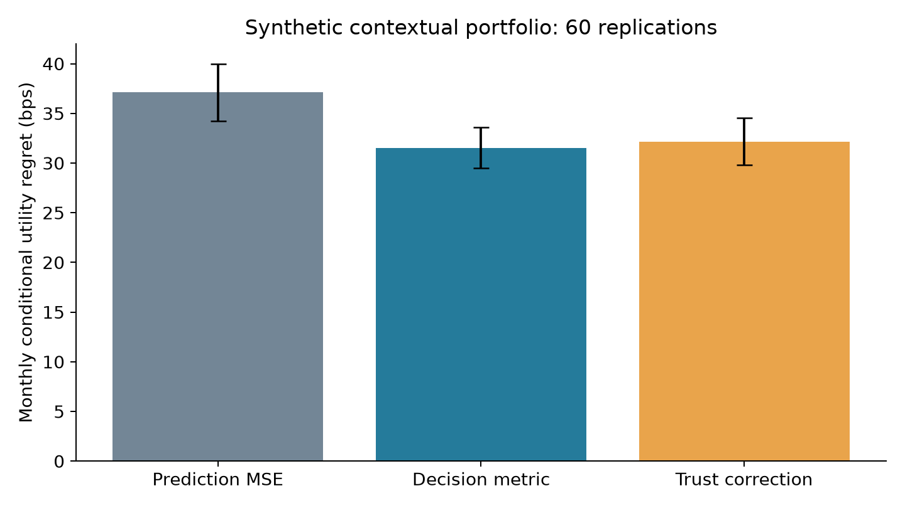
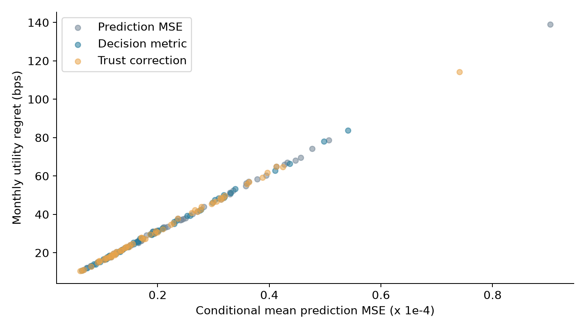

预测收益的平方误差与最终投资决策的损失衡量的是不同对象。前者对各资产的误差逐项计分，后者关心这些误差经过约束与风险矩阵后如何改变配置。对于预算约束下的均值—方差模型，二者之间可以建立精确关系，而不是仅凭回测中的经验相关性推断。本文推导相应的决策度量，并比较受限预测器下的三种训练方式；合成实验显示，决策度量训练降低了平均效用遗憾，受限校正则提供了可度量的预测调整边界。

决策导向学习（decision-focused learning, DFL）将下游优化目标反馈到预测模型。Elmachtoub 与 Grigas 的 Smart “Predict, then Optimize” 提供了经典的任务损失与替代损失框架；Yang 等人的 2025 年 DFF 工作进一步研究有限数据下的偏差校正与可信区域。本文借鉴这一研究问题，但采用有闭式解的二次组合模型，实验没有实现 SPO+ 损失或 DFF 的完整算法。[SPO 原文](https://arxiv.org/abs/1710.08005v5)；[DFF 已发表论文](https://doi.org/10.1609/aaai.v39i25.34891)

近期金融应用也在向包含交易摩擦与现实约束的学习问题推进。Wang Yi 与 Takashi Hasuike 的 2026 年预印本讨论现实市场中的 SPO 组合框架；Yi Wang 与 Takashi Hasuike 于同年发表的另一篇期刊论文研究预测后优化。两篇文章标题和载体不同，本文分别列出，避免将它们未经核验地当成同一稿件。对数学研究而言，值得追问的不仅是哪种训练更有效，还包括何时两种训练本来就等价、约束切换会怎样改变梯度，以及模型校正应该允许多大的自由度。[2026 年预印本](https://arxiv.org/abs/2601.04062v3)；[2026 年期刊论文](https://doi.org/10.20965/jaciii.2026.p1515)

## 问题设定

设上下文特征为 $x\in\mathbb R^d$，下一期收益向量为 $Y\in\mathbb R^N$，真实条件均值为 $\mu(x)$，预测为 $\widehat\mu_\theta(x)$。协方差矩阵 $\Sigma\succ0$ 已知且固定，风险厌恶参数为 $\gamma>0$。本文仅施加预算约束 $\mathbf1^{\top}w=1$，允许卖空，暂不加入交易成本和杠杆上限。

$$
U(w;\mu)=\mu^{\top}w-\frac{\gamma}{2}w^{\top}\Sigma w,
\qquad
w^*(\mu)=\arg\max_{\mathbf1^{\top}w=1}U(w;\mu).
\tag{1}
$$

这里的目标是单期条件效用，不是路径财富或夏普比率。决策遗憾（decision regret）为 $R(\widehat\mu,\mu)=U(w^*(\mu);\mu)-U(w^*(\widehat\mu);\mu)$。实验可以观察合成数据的真实条件均值，故可准确计算该量；在真实市场中，$\mu$ 不可直接观察，必须另外研究评价误差，不能将实现收益当成毫无噪声的均值真值。

**表 1：合成问题的规模与训练约定。**

| 项目 | 设定 |
|---|---|
| 风险资产与特征数 | 6 个资产，3 个特征 |
| 风险厌恶参数 | $\gamma=10$ |
| 单次训练／验证／测试样本量 | 80／120／400 |
| 独立重复次数 | 60 |
| 预测器结构 | 已知共同载荷，3 个共享系数 |
| 校正半径 | 系数欧氏距离不超过 0.0025 |
| 评价范围 | 条件均值误差、条件效用遗憾、平均总敞口 |

## 方法

### 决策损失的几何结构

记 $s=\Sigma^{-1}\mathbf1$，定义 $b_0=s/(\mathbf1^{\top}s)$ 和半正定矩阵

$$
P=\Sigma^{-1}-\frac{ss^{\top}}{\mathbf1^{\top}s}.
\tag{2}
$$

由预算约束的一阶条件可得 $w^*(\mu)=b_0+P\mu/\gamma$。由于 $P\mathbf1=0$，所有资产同时增加同一常数的均值预测，不会改变全额投资组合。这种共同误差可以显著影响通常的平方误差，却对本模型的权重没有影响。

令 $e=\widehat\mu-\mu$。在真实最优权重处，梯度沿预算可行方向为零；因此效用之差等于 $\gamma(w^*(\widehat\mu)-w^*(\mu))^{\top}\Sigma(w^*(\widehat\mu)-w^*(\mu))/2$。再使用 $P\Sigma P=P$，得到

$$
R(\widehat\mu,\mu)=\frac{1}{2\gamma}e^{\top}Pe.
\tag{3}
$$

式 (3) 是本文模型下的精确恒等式。它要求协方差固定正定、只存在预算等式且效用为二次形式；加入非负、杠杆或换手约束以后，通常不能继续直接使用。其含义是错误的资产间相对收益方向通过 $P$ 获得不同惩罚。低风险、可构造相对价值头寸的方向可能被放大，而预算约束消除的共同方向被忽略。

一个容易遗漏的边界情况是：如果对每个资产单独拟合完全自由的线性系数，采用相同特征矩阵，且没有共享限制或正则项，那么左侧的固定任务度量往往不会改变最小二乘解，至多产生预算共同方向上的不可识别性。因此，不能仅因写出式 (3) 就宣称训练方式必然改变。本文刻意使用跨资产共享的受限预测器，使误差方向之间产生取舍。

### 受限预测器与可信校正

预测器设为 $\widehat\mu_\theta(x)=0.004\mathbf1+v\theta^{\top}x$，其中 $v=(1,0.6,0.2,-0.2,-0.6,-1)^{\top}$ 固定，$\theta\in\mathbb R^3$ 待估计。预测误差训练最小化 $\sum_k\|\widehat\mu_\theta(x_k)-Y_k\|_2^2$，等价于将 $v^{\top}(Y_k-0.004\mathbf1)/(v^{\top}v)$ 对特征做最小二乘。决策训练则将目标替换为 $(Y_k-0.004\mathbf1)^{\top}Pv/(v^{\top}Pv)$，对应式 (3) 的经验版本。

收益噪声在固定协方差、零条件均值假设下，会给期望任务损失增加与 $\theta$ 无关的项，所以上述训练并未在总体目标上系统性混淆预测均值与实现收益。但在仅有 80 个训练样本时，噪声依然可以改变系数估计，并使经验任务改善无法转化成样本外改善。这也是引入校正范围约束的原因。

本文的第三种方法是有限路径校正：从预测系数 $\theta_{\mathrm{P}}$ 向任务系数 $\theta_{\mathrm{D}}$ 移动，取 $\theta(a)=\theta_{\mathrm{P}}+a(\theta_{\mathrm{D}}-\theta_{\mathrm{P}})$。在满足 $0\leq a\leq1$ 与 $\|\theta(a)-\theta_{\mathrm{P}}\|_2\leq0.0025$ 的最大区间内，构造五个等距候选点，仅由独立验证集选取任务损失最小者。

这个约束控制的是共享系数距离，不是所有环境下的预测偏差。因为特征各分量位于 $[-1,1]$，可进一步推出 $|v_i x^{\top}(\theta(a)-\theta_{\mathrm{P}})|\leq|v_i|\sqrt3\times0.0025$。它给出了本实验有界特征域内的逐资产预测变化上界，却不构成对域外金融数据的普遍保证。该校正只是受 DFF 问题启发的简化方法，不能以完整 DFF 理论来为其背书。

## 数值实验

全部数据为合成数据。特征 $x_1,x_2,x_3$ 独立均匀分布于 $[-1,1]$。真实条件均值为 $0.004\mathbf1+A x_1+C x_2+D(x_1^2-1/3)$，其中 $A=(0.008,0.006,0.003,0.001,-0.002,-0.004)$，$C=(0.002,-0.003,0.005,-0.005,0.003,-0.002)$，$D=(0.002,-0.001,0.003,-0.002,0.001,-0.003)$。第三个特征不携带信号，用于展示有限样本下不相关变量的估计波动。

收益噪声为多元正态，六个资产标准差分别为 0.025、0.030、0.040、0.050、0.060、0.080，非对角相关系数均为 0.2。预测器无法表示真实均值的全部资产载荷和二次项，因此存在明确的模型错设。每次重复独立生成训练、验证和测试集；三种方法共享这些数据。主种子为 20261006，每次重复加上编号。

**表 2：合成测试结果，括号为 60 次独立重复的蒙特卡洛标准误。**

| 训练方法 | 条件均值 MSE × 10⁴ | 月度效用遗憾 (基点) | 平均总敞口 | 平均系数校正距离 |
|---|---:|---:|---:|---:|
| 预测平方误差 | 0.2382 (0.0189) | 37.11 (2.88) | 1.588 (0.043) | 0 |
| 决策度量 | 0.2015 (0.0134) | 31.53 (2.06) | 1.540 (0.037) | 0.00575 |
| 可信区域内校正 | 0.2056 (0.0155) | 32.15 (2.37) | 1.529 (0.037) | 0.00174 |

MSE 在全部测试样本及资产上平均，总敞口为 $\|w\|_1$，单位为倍数；效用遗憾乘以一万换算为基点。表中风险厌恶系数已参与效用定义，因此该数值不能与月收益的基点简单等同，也没有进行年化。三种方法的每次模拟共享数据，表内误差棒描述各自均值；严格检验差异时，应采用同次模拟的配对差值，而不是直接比较独立误差棒。

图 1：合成测试集的条件效用比较；真实均值仅用于事后评价，不参与训练或校正候选的选择。

图 2：60 次合成重复的预测与决策误差关系，展示不同误差度量间的关联及离散程度。

决策度量的平均遗憾低于预测训练，但本次结果也同时降低了普通 MSE。因此，实验没有证明必须牺牲预测精度才可改善组合，更没有证明对任意数据生成机制都存在优势。其可支持的结论是，在这个明确错设且共享系数的模型中，风险几何改变了噪声与载荷的训练权衡。校正方法的平均系数移动量低于限定半径，但平均遗憾略高于不受限任务训练，体现了约束自由度的代价。

更有研究价值的延伸是约束活跃集合的切换。当非负或杠杆限制被加入，最优权重通常仅分段光滑；应研究跨边界梯度是否稳定，平滑替代产生多大决策偏差，以及训练时使用的可行集是否必须与部署时一致。另一个方向是把持仓状态和交易费用嵌入学习损失，避免逐期训练产生过大的累积换手。还可以将预测校正与可解释性约束联立，例如保留经济符号或因子单调性，再分析任务遗憾和校正幅度的样本复杂度。这些均为待研究问题，本文的闭式恒等式不会自动解决它们。

## 结论与展望

预算约束下的均值—方差决策具有明确的误差几何：共同均值方向被预算消除，相对收益误差按风险结构加权。任务导向训练是否产生不同结果，取决于预测器的共享结构、错设程度、正则项和投资约束。合成实验说明有限校正可以保留任务改进的一部分，同时提供明确的参数变化界限。实际应用仍需加入交易成本、杠杆约束和时序验证，并在独立测试期评价净收益及稳定性。

## 复现说明

在文章目录运行 `python reproduce.py`，依赖 NumPy、pandas 与 Matplotlib，主种子为 20261006。脚本生成 `results.csv`、`results.json`、两幅 PNG，并在每次重复中检查预算约束以及效用差和式 (3) 的一致性。所有表格来自 `results.json`；图字段见 `figures-list.md`。本文实验为原创的简化数学说明，未实现所引论文的完整系统；参考文献状态检索截至 2026-10-05。

## 参考文献

1. Elmachtoub, A. N., & Grigas, P. (2022). Smart “Predict, then Optimize”. *Management Science*, 68(1), 9–26. 已发表，2021 年在线出版、2022 年卷期出版。[DOI](https://doi.org/10.1287/mnsc.2020.3922)；[公开预印本](https://arxiv.org/abs/1710.08005v5)。
2. Yang, J., Liang, E., Su, Z., Zou, Z., Zhen, P., Guo, J., Ma, W., & An, K. (2025). DFF: Decision-Focused Fine-Tuning for Smarter Predict-Then-Optimize with Limited Data. *Proceedings of the AAAI Conference on Artificial Intelligence*, 39(25), 26868–26876. 已发表。[DOI](https://doi.org/10.1609/aaai.v39i25.34891)。
3. Wang Yi, & Hasuike, T. (2026). Smart Predict--then--Optimize Paradigm for Portfolio Optimization in Real Markets. arXiv:2601.04062v3，预印本。[原文](https://arxiv.org/abs/2601.04062v3)。
4. Wang, Y., & Hasuike, T. (2026). Data-Driven Portfolio Optimization Using a Predict-Then-Optimize Framework. *Journal of Advanced Computational Intelligence and Intelligent Informatics*, 30(5), 1515–1525. 已发表，2026-09-20。[DOI](https://doi.org/10.20965/jaciii.2026.p1515)。
