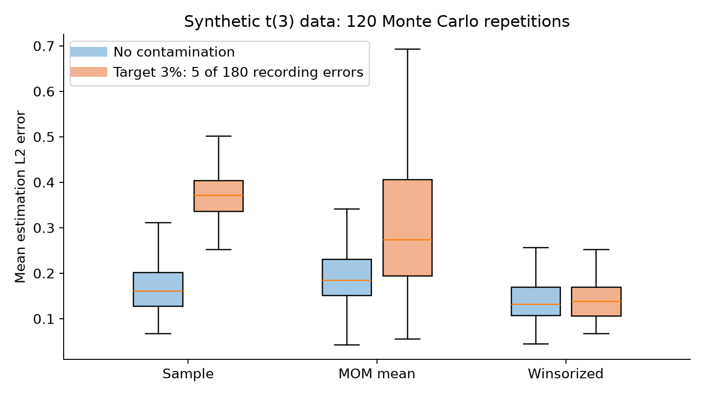
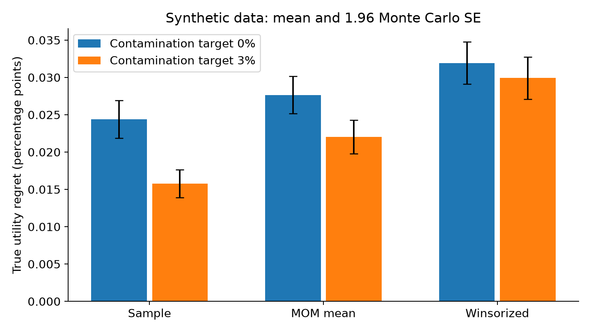

收益分布的厚尾（heavy tails）会削弱经典样本均值和协方差的集中性质，而少量错误记录也可能显著改变优化输入。然而，估计误差下降与投资组合效用上升并不是同一个命题，均值、协方差和可行约束会共同决定最终权重。本文以具有有限二阶矩、没有有限四阶矩的 Student 分布为基础，比较分组均值中位数与坐标温莎化；主要结论是，温莎化确实改善本实验的均值估计误差，却没有改善组合效用，鲁棒估计需要通过决策损失和风险校准进行联合评价。

自然厚尾表示极端观测本身属于真实的数据生成机制；污染（contamination）则表示观测可能经过错误或对抗性修改。前者的目标是有效估计真实厚尾分布，后者的目标是恢复污染前的总体对象。把所有极端收益都当作错误删除，可能同时删去需要控制的尾部风险。实验因此分别生成未污染厚尾训练样本，以及包含正向记录错误的训练样本，并统一用未污染总体评价组合。

Cherapanamjeri 与 Lee 在 2025 年 COLT 正式论文中研究了厚尾估计与对抗鲁棒估计之间的关系。这类统计理论提醒研究者关注失败概率、样本结构和计算复杂度，不能仅用均方误差评价鲁棒性。其一般理论并不自动证明下面的坐标温莎化是最优算法，也不直接证明任何金融策略有效。[正式论文](https://proceedings.mlr.press/v291/cherapanamjeri25a.html)

另一个最新切入点来自 van Parys 与 Zwart 的预印本，2025 年首次提交，2026 年 4 月更新。它讨论非负厚尾随机变量的均值估计，并以限制高估概率的优化需求构造 KL 分布鲁棒准则。本文只借此提出“估计方向应与决策风险相联系”的研究问题；带正负收益、协方差约束和卖空限制的组合模型不满足其问题设定的全部条件，不能直接移植其最优性结论。[预印本原文](https://arxiv.org/abs/2503.21421)

## 问题设定

设 $r_t\in\mathbb R^p$ 为独立同分布收益，$\mu=\mathbb E[r_t]$、$\Sigma=\operatorname{Cov}(r_t)$ 存在。投资组合采用多头且有持仓上限的可行域 $\mathcal W=\{w\geq0:\mathbf1^\top w=1,w_j\leq0.6\}$。真实均值—方差效用定义为

$$
U(w)=\mu^\top w-\frac\gamma2w^\top\Sigma w,
\qquad \gamma=0.4.
\tag{1}
$$

收益单位统一为日收益百分点，方差单位为百分点平方，因此 $\gamma$ 的数值也依赖单位选择。令 $w^*=\arg\max_{w\in\mathcal W}U(w)$ 为真实参数下的 Oracle，决策遗憾（decision regret）为 $U(w^*)-U(\widehat w)$。Oracle 在同一持仓限制下求解，它不是可交易基线。

仅有二阶矩时，样本均值仍然一致，但其高概率误差不一定具有次高斯尾界。协方差的元素涉及两个收益的乘积；要直接用其方差获得通常的平方根样本量浓缩，往往需要四阶矩。本实验采用自由度为 $3$ 的 Student 分布，其协方差存在而四阶矩不存在，正是为了说明均值估计与协方差估计的假设不能混用。

## 方法

第一种稳健均值工具是分组均值中位数（median-of-means, MOM）。将观测随机划为 $B$ 个互不相交组，先在每组计算均值，再对各坐标取中位数：

$$
\widehat\mu_j^{\mathrm{MOM}}
=\operatorname{median}_{1\leq b\leq B}
\left\{\frac{1}{|I_b|}\sum_{t\in I_b}r_{tj}\right\}.
\tag{2}
$$

在独立样本、每坐标有限方差和组规模足够的条件下，Chebyshev 不等式先控制一个组均值失败的概率，随后多数成功组与二项集中给出中位数的高概率控制。若 $B$ 按 $\log(p/\delta)$ 的数量级选择，可以获得坐标最大误差随 $\sqrt{\log(p/\delta)/n}$ 缩小的界，常数还依赖坐标方差上界。这个解释是基础统计机制，不能据此声称坐标 MOM 达到任意协方差结构下的最优欧氏误差，更不能将其厚尾保证视为相同强度的对抗污染保证。

第二种方法使用温莎化（winsorization）：对每个坐标计算样本中位数 $m_j$ 和绝对中位差（median absolute deviation, MAD），将观测限制于 $[m_j-2.5s_j,m_j+2.5s_j]$，其中 $s_j=1.4826\operatorname{MAD}_j$。然后计算裁剪数据的均值与协方差。系数 $1.4826$ 来自正态尺度标定，本实验的 Student 分布并非正态，所以这个尺度不能被称为对真实标准差的无偏估计。此处是简单坐标温莎化，不是求解 Huber 估计方程，也不是 Tyler 协方差估计器。

对样本或裁剪协方差统一施加 $20\%$ 向标量单位阵的线性收缩，保持估计矩阵正定。比较三个可实施输入方案：Sample 使用样本均值和收缩样本协方差；MOM mean 仅替换均值，保留相同协方差以隔离均值效应；Winsorized 同时使用裁剪均值和裁剪协方差。两项鲁棒替换并不具有相同统计目标，特别是裁剪协方差可能低估真实尾部贡献。

鲁棒协方差与组合风险相联系已有早期研究背景，例如 Yang、Couillet 与 McKay 讨论 Tyler 估计与收缩的结合。本实验采用更简单的裁剪诊断，没有实现或验证其估计器。[公开原文](https://arxiv.org/abs/1503.08013)

若 $\widehat w$ 最大化估计效用 $\widehat U(w)$，一个基本决策误差关系是

$$
U(w^*)-U(\widehat w)
\leq2\sup_{w\in\mathcal W}|U(w)-\widehat U(w)|
\leq2R\|\widehat\mu-\mu\|_2
+\gamma R^2\|\widehat\Sigma-\Sigma\|_{\mathrm{op}},
\tag{3}
$$

其中 $R=\sup_{w\in\mathcal W}\|w\|_2$，算子范数记为 $\|\cdot\|_{\mathrm{op}}$。第一步使用估计目标的最优性，第二步使用 Cauchy–Schwarz 与二次型界；无需假定最优解在约束内部。式 (3) 显示仅改善均值误差可能不足以降低遗憾，因为协方差误差项同时存在。这个上界通常偏松，但能指导假设设计与实验拆分。

还应明确估计器拟恢复的对象。裁剪后的总体二阶矩一般不等于原始收益的总体二阶矩，除非加入分布模型并进行正确尺度修正。对于尾部不对称的收益，坐标温莎化甚至会改变总体均值。可行的研究路线包括估计被裁剪部分的尾部贡献、构造风险的置信上界，或直接对组合损失而非每个资产分别裁剪；但在权重由同一数据选择时，还需要一致控制整个可行权重集合，不能仅证明一个固定权重的估计界。

金融时间序列中的波动聚集进一步破坏独立分组假设。随机打乱观测虽然在独立合成实验中方便，却可能掩盖时间相关和结构变化。扩展到真实数据时，可以采用保留顺序的分块验证，并以混合条件或条件矩上界说明组间依赖的影响。对抗污染、自然厚尾和条件异方差也应设置不同实验，以免一种异常机制下的表现被误读为普遍稳健性。

## 数值实验

生成 $p=6$ 个合成资产，每次训练 $180$ 个观测、测试 $4000$ 个观测，共重复 $120$ 次，随机种子 `202610053`。均值为 $(0.03,0.05,0.06,0.075,0.09,0.10)$，波动在 $0.7$ 至 $1.2$ 间等距排列，非对角相关系数为 $0.25$。使用同一个卡方尺度构造多元 Student$(3)$ 收益，再乘以 $\sqrt{1/3}$，使总体协方差等于指定矩阵。MOM 取 $9$ 组，每组 $20$ 个观测。

污染实验的名义比例为 $3\%$，实际修改 $\operatorname{round}(180\times0.03)=5$ 个训练观测，即 $2.78\%$。修改规则是在随机选定的记录中给第一个资产加 $12$ 个百分点，模拟单方向记录偏差；测试集始终来自未污染 Student 总体。这个污染机制不是最坏对抗者，也不代表真实危机收益，因此其效果只适用于本机制演示。

**表 1：合成数据的均值欧氏误差与真实效用遗憾，120 次重复均值，单位为日收益百分点**

| 训练记录状态 | 方法 | 均值误差 | 效用遗憾 |
|---|---|---:|---:|
| 未污染 | Sample | 0.17284 | 0.02440 |
| 未污染 | MOM mean | 0.19018 | 0.02766 |
| 未污染 | Winsorized | 0.13820 | 0.03194 |
| 5/180 被修改 | Sample | 0.37238 | 0.01575 |
| 5/180 被修改 | MOM mean | 0.30269 | 0.02205 |
| 5/180 被修改 | Winsorized | 0.14148 | 0.02992 |

温莎化在两个训练环境中的均值误差最低，但其效用遗憾并未最低。MOM 在未污染环境中也没有优于样本均值：分组导致单组样本量下降，有限样本效率损失可能超过厚尾保护的收益。高概率理论侧重低失败概率的尾部保证，不能被解释为固定样本量下平均误差必然更小。

**表 2：训练中 5/180 记录被修改时的组合风险与资产 1 权重，120 次重复均值；风险单位为日收益百分点**

| 方法 | 真实波动 | 测试 CVaR95 | 资产 1 权重 |
|---|---:|---:|---:|
| Sample | 0.63409 | 1.35355 | 0.23354 |
| MOM mean | 0.66637 | 1.42165 | 0.15816 |
| Winsorized | 0.70111 | 1.49086 | 0.17472 |
| Oracle | 0.56412 | 1.19585 | 0.19936 |

图 1：合成 Student$(3)$ 收益的均值欧氏误差箱线图，每组 120 次重复；“3%”表示名义污染目标，实际为 5/180，箱线图不显示离群点。

图 2：合成数据中真实效用遗憾的均值，误差棒为 $1.96$ 倍 Monte Carlo 标准误；它反映重复实验均值的数值不确定性。

本实验中污染后的 Sample 遗憾反而低于未污染 Sample。这是输入偏差同时改变均值和风险估计、并偶然把权重推向较有利区域的有限样本现象，不支持故意污染数据。表 2 中 Sample 的资产 1 权重更接近 Oracle，不能据此推出其参数估计更准确。温莎化对协方差的压缩与风险厌恶参数固定之间存在失配，可能导致组合过度暴露于被低估的真实风险；目前比较同时改变了多个输入，这一解释需要增加“只改均值”“只改协方差”“重新标定尺度”的消融实验才能确证。

## 结论与展望

厚尾、污染与决策失误需要各自清晰的问题设定，本实验给出了统计精度改善却未带来效用改善的具体例子。可研究的第一项课题是，在有限二阶矩下构造组合二次风险的直接鲁棒估计，并把所需尾部条件明确写入非渐近保证。第二项课题是，将均值的单侧置信下界、协方差风险上界和交易约束组合成同一个可解模型，研究其遗憾与保守性。第三项课题是，在非对称厚尾和时间依赖下设计分组或裁剪规则，避免删除真实风险信息；本文没有证明这些扩展的最优性，也不把预印本结论直接外推到金融数据。

## 复现说明

在本目录运行 `python reproduce.py`，依赖 NumPy、SciPy、pandas 和 Matplotlib，随机种子为 `202610053`。`replicates.csv` 保存全部 $960$ 个“重复—污染状态—方法”结果，`results.json` 保存参数、真实 Oracle 效用与汇总标准误，脚本生成两张 PNG。均值—方差效用由已知总体参数精确计算，CVaR95 来自独立合成测试样本；效用与 CVaR 并非同一个优化目标。图件字段与实际污染比例说明见 `figures-list.md`，脚本不会下载资产行情。

## 参考文献

1. Cherapanamjeri, Y., & Lee, D. (2025). Heavy-tailed Estimation is Easier than Adversarial Contamination. *Proceedings of the Thirty-Eighth Conference on Learning Theory*, PMLR 291, 1154–1184. 正式会议论文。[原文与官方元数据](https://proceedings.mlr.press/v291/cherapanamjeri25a.html).
2. van Parys, B. P. G., & Zwart, B. (2025/2026). Robust Mean Estimation for Optimization: The Impact of Heavy Tails. arXiv:2503.21421，2025-03-27 首次提交，v2 于 2026-04-20 更新；预印本。[原文](https://arxiv.org/abs/2503.21421).
3. Yang, L., Couillet, R., & McKay, M. R. (2015). A Robust Statistics Approach to Minimum Variance Portfolio Optimization. arXiv:1503.08013。本文引用其公开预印本，作为鲁棒协方差与组合风险相联系的早期研究背景。[原文](https://arxiv.org/abs/1503.08013).
