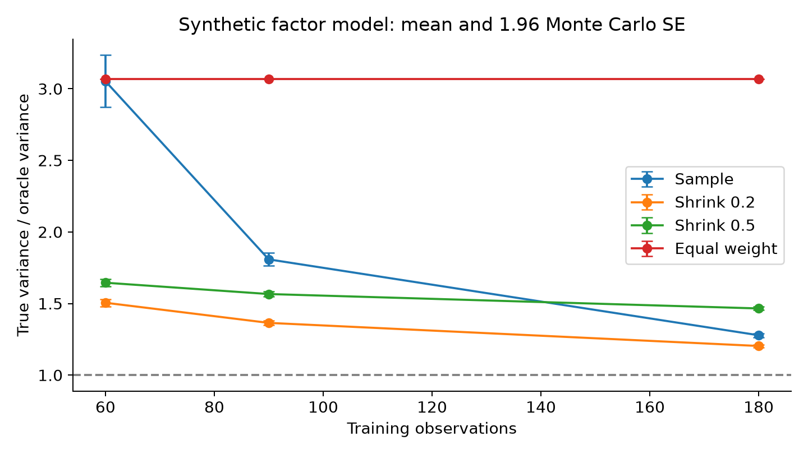
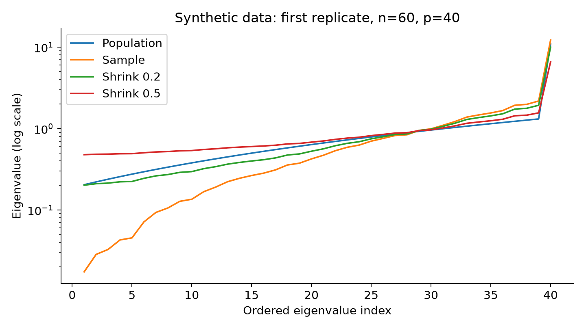

最小方差组合看似只需要估计一个协方差矩阵，但最终持仓使用该矩阵的逆，因此小的统计误差也可能产生大的决策误差。高维统计（high-dimensional statistics）研究资产数与有效观测数相近时的估计行为，投资组合则进一步要求理解误差经过优化映射后的放大。本文从最小方差解的扰动公式出发，结合一组可复现的线性收缩实验；主要结论是，改善矩阵条件数能够显著降低部分优化误差，但更强收缩未必带来更低真实风险，估计目标应考虑组合约束与决策损失。

经典线性收缩（linear shrinkage）将样本协方差与结构化目标作凸组合。Ledoit 与 Wolf 的 2004 年论文确立了这一估计路线，其统计最优性以特定高维极限和矩阵二次损失为背景。矩阵损失、组合方差和持仓稳定性属于不同评价目标，不能把某一矩阵估计器的最优性直接理解为任意组合问题上的最优性。[作者提供的原始论文](https://www.ledoit.net/Well-conditioned2004.pdf)

近期正式研究进一步关注特征向量的方向误差。Goldberg、Gurdogan 与 Kercheval 于 2025 年发表的论文，将主要样本特征向量向由约束梯度生成的子空间收缩，讨论相应单因子结构中的高维低样本极限。这一思路提示：约束不仅是优化器末端的限制，还可以参与统计估计目标的构造。[正式论文](https://doi.org/10.1007/s00780-025-00566-4)

本文不实现该论文的 James–Stein 特征向量估计器，也不把固定线性收缩命名为该方法。小型数值实验首先隔离“求逆放大”与“过度收缩”两种机制，再提出可以拓展成数学论文的研究问题。文献核查截止日期为 2026 年 10 月 5 日，理论解释、本文诊断实验与未来研究设想在以下各节分别说明。

## 问题设定

记 $r\in\mathbb R^p$ 为一期收益，$\Sigma\succ0$ 为总体协方差，$S$ 为去均值样本协方差，$\mathbf1$ 为全一向量。全局最小方差组合（global minimum-variance portfolio, GMV）在允许卖空、仅有预算约束时具有闭式解：

$$
w(\Sigma)=\frac{\Sigma^{-1}\mathbf1}{\mathbf1^\top\Sigma^{-1}\mathbf1},
\qquad \mathbf1^\top w=1.
\tag{1}
$$

真实风险是 $w(S)^\top\Sigma w(S)$，训练风险是 $w(S)^\top S w(S)$。两者使用同一权重，但评价矩阵不同，后者还带有用训练数据选择最优权重的选择效应。本文使用真实已知的合成协方差进行评价，避免把训练风险误当作样本外风险。真实矩阵计算出的权重称为 Oracle，它只作为不可实施的基准。

更一般地，若线性约束为 $A^\top w=b$，其中 $A\in\mathbb R^{p\times k}$ 满列秩，则

$$
w(\Sigma;A,b)=\Sigma^{-1}A(A^\top\Sigma^{-1}A)^{-1}b.
\tag{2}
$$

式 (2) 显示，误差的影响同时取决于协方差与约束方向。若加入非负、持仓上限或换手限制，最优解通常不再具有这个全局闭式形式，活动约束集的变化也可能引入不光滑性。本实验保留预算约束和卖空许可，以便清楚观察求逆机制；研究扩展到实际交易时必须补充这些约束。

## 方法

令 $H$ 为对称协方差扰动，且 $\Sigma+uH$ 在 $u=0$ 的邻域保持正定。对式 (1) 求方向导数可得

$$
D w(\Sigma)[H]
=-(I-w\mathbf1^\top)\Sigma^{-1}Hw.
\tag{3}
$$

推导只需使用 $D(\Sigma^{-1})[H]=-\Sigma^{-1}H\Sigma^{-1}$，再对归一化分母求导。投影型因子 $I-w\mathbf1^\top$ 保证导数权重之和为零。式 (3) 指出：误差大小 $\|H\|$ 不是唯一因素，误差作用于当前权重的方向以及 $\Sigma^{-1}$ 的谱结构同样重要。若估计矩阵包含接近零的特征值，对应逆特征值就会非常大，导致优化器用估计噪声构造表面上低风险的对冲。

实验采用固定强度的线性收缩：

$$
S_a=(1-a)S+a\tau I,\qquad
\tau=\frac{\operatorname{tr}(S)}p,\qquad a\in\{0,0.2,0.5\}.
\tag{4}
$$

当 $0<a<1$ 时，最小化 $w^\top S_a w$ 等价于最小化 $w^\top S w+[a\tau/(1-a)]\|w\|_2^2$。这揭示了统计收缩与持仓正则化之间的对应关系。该等价性依赖目标矩阵为标量单位阵；换用行业目标或因子目标，附加项会变为相应二次型。较大 $a$ 抬高小特征值、改善条件数，却也可能抹平真实资产风险差异，并削弱有用的因子对冲。

因此，一个直接的研究方向是把收缩参数的选择目标从矩阵误差转向优化后的真实风险。理想化目标是 $\mathbb E[w(S_a)^\top\Sigma w(S_a)]$，但 $\Sigma$ 未知，应构造独立验证风险估计、无偏风险近似或带置信上界的替代准则。评价时需要区分训练样本、调参样本和最终测试样本；若在最终测试期间选择最优收缩系数，再报告同一期间的表现，会低估决策误差。

2025 年的约束导向特征向量工作带来另一个问题：仅调整特征值是否足够？如果主要误差来自因子方向相对于预算或收益约束的偏移，统一抬升特征值不能完全矫正方向偏差。该论文的理论环境是高维低样本的单因子及其扩展结构，不能未经证明外推到任意多因子模型、非平稳时间序列或尾指数不足以支持四阶矩的分布。值得研究的是多约束子空间的随机估计误差，以及其与特征值收缩共同作用时的决策风险。

一个更具体的数学课题，是研究矩阵误差在可行方向上的局部作用。对约束 $A^\top w=b$，允许的权重扰动落在 $A^\top v=0$ 的切空间；因此，某些矩阵误差虽然具有较大的全矩阵范数，却可能主要发生在决策无法利用的方向。反过来，规模很小但与最优持仓高度相关的误差也可能影响最终风险。若能建立只涉及可行切空间和持仓方向的误差度量，就可能获得比统一算子范数界更有解释力的决策风险控制。

研究加入多头与持仓上限后的情形，还需要区分活动约束固定与活动约束切换。在固定活动面内部，可以在较低维自由权重上分析受限二次规划的灵敏度；当资产权重触及零或上限时，同一导数表达不能直接延续。一个可验证的路线是先给出严格互补条件下的局部稳定性，再建立约束切换附近的分段误差界。数值实验可以记录活动集变化频率，从而判断权重跳动来自参数噪声还是约束边界。

此外，统计估计窗口与市场非平稳性构成另一种偏差—方差权衡。增加样本量在本实验中只降低估计方差，因为总体协方差固定；真实时间序列中，过长窗口可能纳入已经失效的相关结构。后续研究可以把有效样本量、指数加权衰减和收缩强度共同参数化，并在已知变化点或平滑漂移模型下分析最优尺度。该问题需要新的分布假设，不能把本节独立同分布实验的结论直接外推。

## 数值实验

实验为合成高斯单因子收益，资产数 $p=40$。设 $\beta_j$ 在 $0.4$ 至 $1.2$ 间等距排列，特异波动 $d_j$ 在 $0.45$ 至 $1.15$ 间等距排列，构造

$$
r_t=0.6\beta f_t+De_t,\quad
f_t\sim N(0,1),\quad e_t\sim N(0,I),\quad
\Sigma=0.36\beta\beta^\top+D^2.
\tag{5}
$$

所有变量独立同分布，波动单位为日收益百分点。训练样本量分别为 $60,90,180$，每个设置独立重复 $100$ 次，固定随机种子 `202610052`。比较样本 GMV、$a=0.2$ 与 $a=0.5$ 的收缩 GMV、等权和 Oracle。收缩强度预先固定，没有用真实协方差选择最佳系数；本实验属于有限样本诊断，而非 2025 年特征向量理论的数值验证。

**表 1：训练样本量为 60 时的实际实验均值，100 次重复；波动单位为日收益百分点**

| 方法 | 真实波动 | 估计波动 | 真实方差/Oracle | 总杠杆 $\|w\|_1$ | 条件数 |
|---|---:|---:|---:|---:|---:|
| 样本 GMV | 0.49151 | 0.16123 | 3.05295 | 3.27311 | 583.37 |
| 收缩 0.2 | 0.34810 | 0.24952 | 1.50547 | 1.86354 | 44.93 |
| 收缩 0.5 | 0.36398 | 0.27068 | 1.64544 | 1.35726 | 12.69 |
| 等权 | 0.49747 | — | 3.06917 | 1.00000 | — |
| Oracle | 0.28396 | 0.28396 | 1.00000 | 1.79021 | 53.32 |

样本 GMV 的训练风险明显偏低：估计波动均值为 $0.16123$，真实波动均值却为 $0.49151$。收缩 $0.2$ 将真实方差比降至 $1.50547$，同时降低杠杆。这里风险比是逐次计算后求平均，不等于“平均波动的平方除以 Oracle 方差”，避免这两种汇总口径混用。

**表 2：不同训练样本量下的真实方差比，100 次重复均值**

| 训练样本量 | 样本 GMV | 收缩 0.2 | 收缩 0.5 | 等权 | Oracle |
|---|---:|---:|---:|---:|---:|
| 60 | 3.05295 | 1.50547 | 1.64544 | 3.06917 | 1.00000 |
| 90 | 1.80841 | 1.36487 | 1.56635 | 3.06917 | 1.00000 |
| 180 | 1.27848 | 1.20345 | 1.46568 | 3.06917 | 1.00000 |

图 1：合成因子数据中各方法真实方差相对于 Oracle 的比值，误差棒为 $100$ 次重复均值的 $1.96$ 倍 Monte Carlo 标准误。

图 2：合成数据在 $n=60$ 的第一次重复中得到的排序特征值，纵轴使用对数尺度，展示收缩对小特征值的抬升。

当样本量增至 $180$，收缩 $0.5$ 的条件数仍然优于样本矩阵，但真实方差比 $1.46568$ 高于样本 GMV 的 $1.27848$。这说明条件数是数值稳定性指标，不能代替最终决策风险。样本量增大后，统一收缩引入的结构偏差可能超过其降噪收益。等权真实风险比保持常数，是因为同一总体协方差和同一固定权重用于精确评价，并非每次随机测试刚好相同。

## 结论与展望

本文将高维估计误差与组合误差通过方向导数连接起来，实验支持适度收缩能减少求逆放大，却不支持越强收缩越好的规则。可研究的第一项课题，是对多个线性约束给出收缩估计的非渐近决策风险界，解释约束子空间与因子方向的夹角如何进入误差项。第二项课题，是在特征值与特征向量联合收缩中加入时间平滑和换手惩罚，证明参数更新时持仓的稳定性。第三项课题，是把厚尾鲁棒估计与约束导向收缩结合，明确仅有二阶矩时哪些保证仍然成立；这些均为研究设想，本文没有给出新的最优性定理。

## 复现说明

在本目录执行 `python reproduce.py`，使用 NumPy、pandas 和 Matplotlib，随机种子为 `202610052`。脚本将 $1500$ 个“样本量—重复—方法”结果写入 `replicates.csv`，将第一组特征值写入 `spectrum.csv`，汇总与实验单位写入 `results.json`，并生成 `fig1.png`、`fig2.png`。由于总体协方差已知，风险直接计算而非通过随机测试集再估计；图件字段与误差棒含义见 `figures-list.md`。本实验允许卖空，不含交易费用，不能据此评价可交易策略的实际收益。

## 参考文献

1. Ledoit, O., & Wolf, M. (2004). A well-conditioned estimator for large-dimensional covariance matrices. *Journal of Multivariate Analysis*, 88(2), 365–411. 正式发表。[DOI](https://doi.org/10.1016/S0047-259X(03)00096-4)、[作者原文](https://www.ledoit.net/Well-conditioned2004.pdf).
2. Goldberg, L. R., Gurdogan, H., & Kercheval, A. (2025). Portfolio optimisation via strategy-specific eigenvector shrinkage. *Finance and Stochastics*, 29, 665–706. 2025-05-21 正式发表。[DOI](https://doi.org/10.1007/s00780-025-00566-4).
