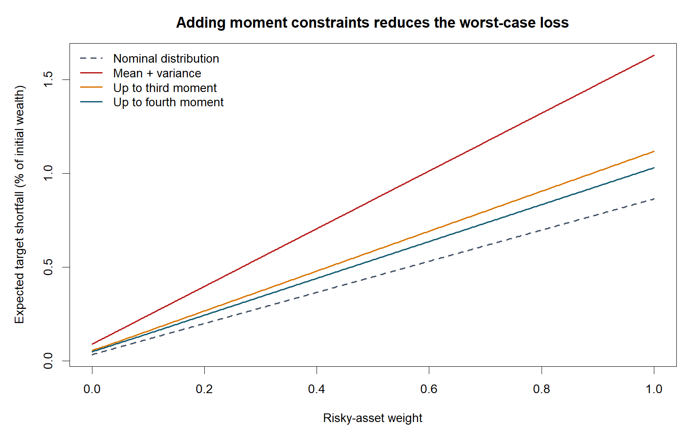
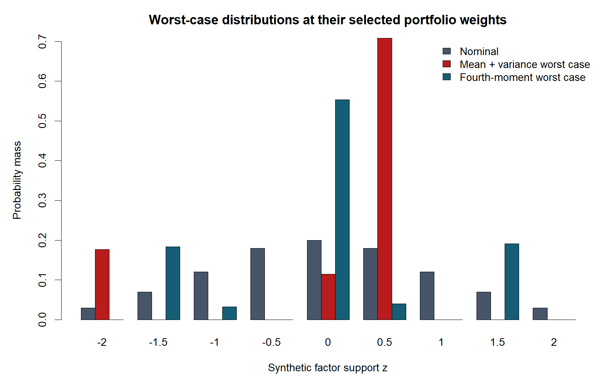

均值与协方差能够决定线性组合的前两阶矩，却通常不能唯一确定某个财富目标以下的损失。当资产收益还包含非线性因子项时，相同低阶矩对应的尾部缺口可能明显不同。本文围绕矩约束下的最坏缺口风险展开，主要结论是：**高阶矩信息可以缩小最坏分布集合并改变最优配置，但更多矩约束的经济收益必须与估计误差、支撑集误设以及优化证书的有效性共同评估。**

分布鲁棒优化（distributionally robust optimization, DRO）将分布不确定性写为一组可能概率律，而不是直接假定一个完全已知的正态模型。矩模糊集（moment ambiguity set）适合表达均值、方差及高阶矩信息。其优点是与广义矩问题的对偶结构相联系；不足是未经校准的精确样本矩可能过度排除真实分布。早期的矩不确定性研究已把模型设计与数据置信区域联系起来 [1]，因此数学上的集合缩小不能直接解释为样本外风险保证的增强。

Yang、Yang 与 Zhong 于 2026 年 6 月提出多项式因子收益下的分布鲁棒货币缺口风险模型，并以非负多项式锥和矩—平方和方法处理分段线性损失 [2]。这一工作提供了将非线性因子关系、分布不确定性与全局优化联系起来的研究入口。该文截至 2026 年 10 月 5 日为预印本；本文只据其已公开模型讨论方法联系，不宣称复现其真实股票实验或半正定算法。

本文补充一个完全执行的有限支撑实验：把最坏目标缺口写成线性规划，穷举全部基可行分布，同时求取有限支撑上的多项式对偶上界。实验显示，二阶矩模型选择零风险资产，而加入三阶或四阶矩后选择全部风险资产；这个离散化实例说明，配置改变可能来自尾部概率质量重新分配，而非均值改善。本文进一步区分矩信息阶数与平方和松弛阶数，并提出具有统计覆盖率和数值证书的后续研究问题。

## 问题设定

记因子为 $z\in K$，资产收益为多项式向量 $r(z)$，配置向量为 $w\geq0$ 且 $\mathbf1^{\top}w=1$。货币缺口风险（monetary shortfall risk）的一般形式为

$$
\mathcal R(w)=\inf_{t\in\mathbb R}
\left\{t:\sup_{P\in\mathcal P}\mathbb E_P\big[\ell(-w^{\top}r(z)-t)\big]\leq\beta\right\},\tag{1}
$$

其中 $\ell$ 为凸、递增、非常数的损失函数，$\beta$ 是给定容忍水平，$t$ 具有投入资本的含义 [3]。若 $\ell$ 分段线性而 $r$ 多项式，则被积函数为若干多项式片段的最大值。本文的数值实验固定收益目标 $\tau$，研究 $S_P(w)=\mathbb E_P[(\tau-w^{\top}r(z))_+]$，并将其作为配置目标的惩罚项。这个量称为“目标缺口期望”，区别于式 (1) 对资本 $t$ 的优化，也区别于通常作为 CVaR 同义词的 expected shortfall。

在有限支撑 $K_h=\{z_1,\ldots,z_n\}$ 上，令 $q_j$ 表示概率，$a_d(z)=(1,z,\ldots,z^d)^{\top}$，$m_d$ 表示已知矩向量。本文采用

$$
\mathcal Q_d=\left\{q\in\mathbb R_+^n:
\sum_{j=1}^{n}q_j a_d(z_j)=m_d\right\},\qquad
S_d(w)=\max_{q\in\mathcal Q_d}\sum_{j=1}^{n}q_j(\tau-w^{\top}r(z_j))_+.\tag{2}
$$

因 $m_0=1$，概率质量约束已包含在式 (2) 中。所有矩都取自同一名义概率向量，故模糊集非空；有限支撑和概率归一化保证它是紧多面体，最坏期望存在。若更高阶矩延续同一组低阶矩，则 $\mathcal Q_{d+1}\subseteq\mathcal Q_d$，同一配置的最坏缺口单调不增，但不同配置的最优权重并无一般单调规律。

## 方法

### 最坏分布与多项式上界

固定配置后，式 (2) 是有限维线性规划，其对偶为

$$
\min_{y\in\mathbb R^{d+1}}m_d^{\top}y
\quad\text{s.t.}\quad
a_d(z_j)^{\top}y\geq (\tau-w^{\top}r(z_j))_+,
\quad j=1,\ldots,n.\tag{3}
$$

左端对应一个次数不超过 $d$ 的多项式。它在每个支撑点上支配损失函数，对任何满足矩约束的分布都给出相同期望上界。由于本实验原问题可行且目标有界，有限维线性规划强对偶适用，无须额外假定概率向量严格为正。程序以范德蒙德矩阵的 $d+1$ 列为候选基，求解概率并检验非负性；退化基产生的重复分布按十二位小数识别后去重。随后枚举对偶的候选活动约束，检验上界在全部九个点上的有效性，取得与原问题一致的目标值。

这种穷举适用于小规模教学模型，不能替代高维线性规划求解器。其价值在于把“最坏分布”与“风险上界”同时交付：原问题的概率律给出可达到的风险下界，对偶多项式给出有效上界；二者一致时，可验证的是这个有限支撑风险子问题。外层配置使用有限网格，因此全局证明范围限于该网格，不能自动扩展为连续配置空间中的精确最优性。

### 从离散对偶到矩—平方和方法

当支撑集变成连续半代数集合 $K=\{z:g_i(z)\geq0\}$ 时，式 (3) 的有限个不等式变成整个 $K$ 上的非负多项式约束。对于正部损失，只需要求上界多项式分别支配零和 $\tau-w^{\top}r(z)$ 两个片段。平方和（sum of squares, SOS）证书的一般形式是

$$
p(z)-h(z)=\sigma_0(z)+\sum_i\sigma_i(z)g_i(z),
\qquad \sigma_i\text{ 为平方和多项式}.\tag{4}
$$

式 (4) 给出集合上非负性的充分证书，并转化为半正定矩阵约束。这里的证书方向尤其重要：用 SOS 多项式限制对偶上界，通常得到真实最坏风险的保守上界；有限网格上的约束仅覆盖网格点，可能低估连续支撑上的最坏风险。本实验计算的是九点支撑模型本身，没有执行 SOS 层级，更没有用其图形证明连续区间上非负。

Lasserre 的矩层级 [4] 与 Putinar 的正性表示 [5] 提供理论背景，但不能无条件声称有限阶松弛精确。渐近论证通常需要生成支撑集的二次模具有 Archimedean 性，例如显式包含某个球约束；仅说支撑集紧并不足以证明给定生成元满足这一性质。连续矩问题的强对偶还应检查矩锥闭性或相应相对内点条件。有限收敛、代表测度提取与原模型最优性认证需要额外条件；矩矩阵秩稳定及局部化矩阵条件可帮助识别有限原子测度，但单个秩等式不替代原问题可行性与上下界一致性检查。

应严格区分两个参数：$d$ 是使用到几阶矩，改变的是信息集合；SOS 松弛阶数 $k$ 改变的是同一个问题的计算近似精度。提高 $d$ 可能引入更不可靠的统计约束，而提高 $k$ 主要增加矩阵维度。把两者混合比较，会将“获得更多分布信息”错误归因于“算法更准确”。

## 数值实验

全部数据为确定性合成数据。因子支撑为 $z=(-2,-1.5,-1,-0.5,0,0.5,1,1.5,2)$，名义概率为 $(0.03,0.07,0.12,0.18,0.20,0.18,0.12,0.07,0.03)$。前五个矩为 $(1,0,0.885,0,1.93125)$。防御资产收益设为 $r_D(z)=0.025+0.005z$，风险资产收益设为 $r_A(z)=0.060+0.050z-0.008z^2$，其权重记为 $v$，因此组合收益为 $(1-v)r_D+vr_A$。

收益目标 $\tau=0.02$，风险惩罚 $\kappa=2$，外层最小化 $-\mathbb E_{P_0}r_v+\kappa S_d(v)$。因两个资产收益次数至多为二且各模糊集共享一、二阶矩，其期望收益在这些分布下都等于名义期望，故这一设置没有隐藏的均值变化。配置网格为 $v=0,0.002,\ldots,1$，共 501 个点。二、三、四阶矩集合去重后分别包含 29、24、23 个极点分布；极点数不必随集合收缩单调变化。

**表 1：各信息集合的网格最优配置，合成数据；收益与缺口均以初始财富百分比报告**

| 模型 | 风险资产权重 | 期望收益 | 名义目标缺口 | 本模型最坏目标缺口 | 目标函数值 |
|:---|---:|---:|---:|---:|---:|
| 名义分布 | 1.000 | 5.2920% | 0.8630% | 0.8630% | −3.5660% |
| 一、二阶矩 | 0.000 | 2.5000% | 0.0325% | 0.0885% | −2.3230% |
| 至三阶矩 | 1.000 | 5.2920% | 0.8630% | 1.1168% | −3.0584% |
| 至四阶矩 | 1.000 | 5.2920% | 0.8630% | 1.0293% | −3.2335% |

表 1 中风险资产权重的改变并不是“鲁棒优化失效”，而是对尾部信息的敏感性。仅约束前两阶矩时，最坏分布能够把 0.177 的概率质量放到因子 −2，同时用正因子补偿均值；这一配置使即使防御资产也产生 0.0885% 的最坏目标缺口。加入三阶矩为零约束后，这种不对称概率安排受到限制。注意零三阶矩并不要求分布关于零对称，图 2 中最坏分布仍可以不对称。

**表 2：固定满仓风险资产时的信息价值及最优配置处的对偶校验，合成数据**

| 矩集合 | 满仓时最坏目标缺口 | 最优配置处原问题值 | 对偶上界值 | 原对偶差绝对值 |
|:---|---:|---:|---:|---:|
| 一、二阶矩 | 1.6284% | 0.0885000% | 0.0885000% | 3.25×10⁻¹⁹ |
| 至三阶矩 | 1.1168% | 1.1167857% | 1.1167857% | 1.73×10⁻¹⁸ |
| 至四阶矩 | 1.0293% | 1.0292667% | 1.0292667% | 0 |

表 2 的首列风险是在同一满仓配置上评价，因而可用于比较信息集合收缩带来的缺口降低。原问题值与对偶上界则在各自最优配置处评价，二阶矩模型对应的是零风险资产，不能把两组数误认为同一个组合；最后一列绝对差以初始财富为单位，未乘以百分比因子。数值上的近零对偶差说明有限支撑子问题被正确求解；它不证明数据矩等于真实市场矩，也不证明连续因子模型的最坏风险已得到精确认证。图 2 的二阶与四阶最坏分布亦对应不同权重，因而主要展示证据分布，而不是控制变量完全相同的比较实验。

## 结论与展望

矩约束中的信息阶数能够显著改变目标缺口和配置，但这种变化必须在相同权重、相同支撑集下区分信息价值与决策响应。第一项可研究方向是以置信区域替代高阶矩等式，在重尾因子下建立覆盖率、可行性及缺口风险界之间的联系。第二项是利用因子稀疏性和相关稀疏结构降低 SOS 矩阵规模，同时保留可验证的上下界及原子测度证书。第三项是控制多项式收益近似误差与支撑离散化误差，避免将有限网格的风险下估计用于真实约束。本文仅提供有限支撑与配置网格上的机制验证，尚未实施连续支撑 SOS 求解或真实数据的滚动检验。

## 复现说明

脚本 `reproduce.R` 仅使用 base R，记录种子 `20261005`，当前实验没有随机抽样。进入文章目录运行 `Rscript --vanilla reproduce.R`，或在项目根目录运行 `Rscript --vanilla content/papers/moment-shortfall-sos/reproduce.R`。运行后生成 `results.csv`、`support.csv`、`shortfall-curves.csv`、`worst-distributions.csv`、三个 `dual-moments-*.csv` 及两张 1600×1000 PNG；对偶系数文件允许逐点检查式 (3)。脚本将原对偶差小于 $10^{-8}$ 作为校验，正文报告实际误差。`figures-list.md` 给出字段清单；确定性枚举不报告蒙特卡洛置信区间。

## 参考文献

1. Delage, E., & Ye, Y. (2010). Distributionally Robust Optimization Under Moment Uncertainty with Application to Data-Driven Problems. *Operations Research*, 58(3), 595–612. [作者预印本](https://web.stanford.edu/~yyye/distRobOpt_OR_rev0.pdf)，[DOI](https://doi.org/10.1287/opre.1090.0741)。
2. Yang, Y., Yang, L., & Zhong, S. (2026). Distributionally robust shortfall risk portfolio model with moment ambiguity sets. *arXiv preprint*, 2606.05996v1，2026-06-04 提交。[论文与版本记录](https://arxiv.org/abs/2606.05996v1)。截至 2026-10-05 按预印本引用。
3. Föllmer, H., & Schied, A. (2002). Convex measures of risk and trading constraints. *Finance and Stochastics*, 6(4), 429–447. [作者文献目录](https://www.math.hu-berlin.de/~foellmer/publications.html)，[DOI](https://doi.org/10.1007/s007800200072)。
4. Lasserre, J. B. (2001). Global Optimization with Polynomials and the Problem of Moments. *SIAM Journal on Optimization*, 11(3), 796–817. [出版社论文页](https://epubs.siam.org/doi/10.1137/S1052623400366802)。
5. Putinar, M. (1993). Positive Polynomials on Compact Semi-Algebraic Sets. *Indiana University Mathematics Journal*, 42(3), 969–984. [期刊引文页](https://iumj.org/article/3638/cite/)。
