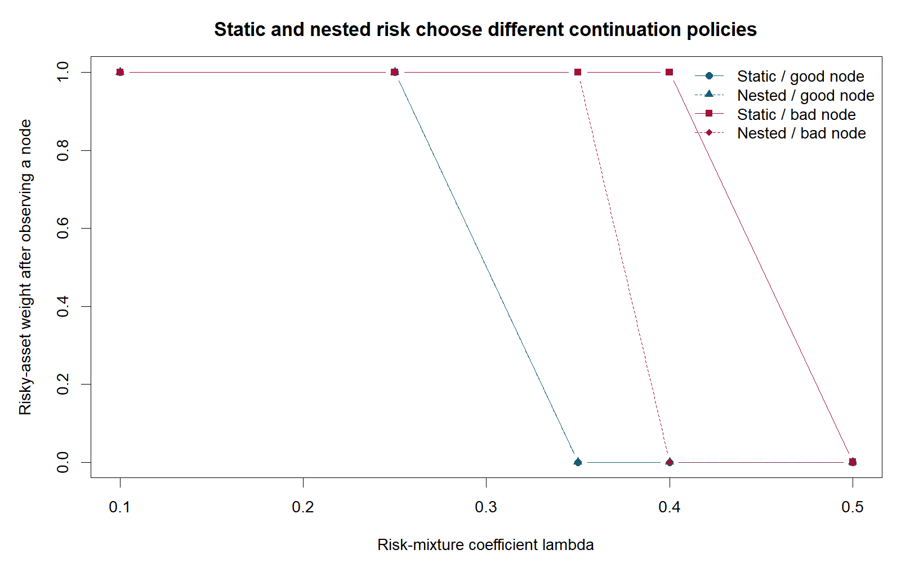
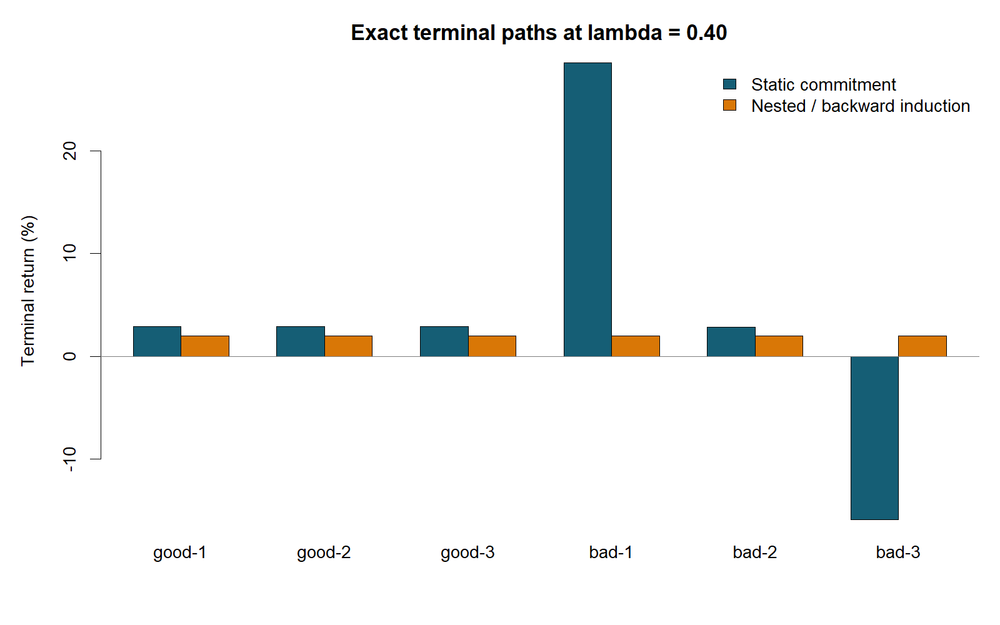

多期投资组合的困难不仅是预测未来收益，还在于今天认可的配置方案能否在明天观察市场后继续执行。终端条件风险价值（conditional value-at-risk, CVaR）按照起点概率评估全部路径；投资者进入某一节点后，面对的却是条件分布，原先处于整体尾部之外的事件可能变成当前尾部。本文以风险递推的数学结构和可复现情景树为中心，主要结论是：**终端风险的事前最优、嵌套风险的递推最优与时间不一致目标的均衡策略是不同概念，必须先明确目标再比较算法。**

风险厌恶动态规划（risk-averse dynamic programming）提供了一条清晰路线：先定义单期条件风险映射，再把后续风险逐层嵌套。Ruszczyński 的研究给出与马尔可夫状态相联系的风险递推框架 [1]。这一思路保证的是递推准则下的条件排序一致性；其代价是风险偏好本身发生改变，因此不能把嵌套 CVaR 视为终端 CVaR 的计算近似。尤其在长投资期限下，重复施加尾部惩罚可能明显改变风险暴露。

近期研究进一步提示，应将长期财富目标与动态激励一起设计。Dang 与 Chen 的预印本比较多期均值—缓冲超越概率与均值—CVaR，并讨论事前承诺及时间一致形式，其最新版本为 2026 年 2 月 15 日 v3 [3]。Linghu、Liu 与 Deng 的 2026 年 9 月更新预印本研究预测和多期配置的联合学习 [4]。前者关心风险准则与目标解释，后者关心预测误差与跨期交易决策；二者都说明，只改善单期预测精度不足以解决多期决策问题。

本文的工作包括定义两种可比较的风险目标、说明条件风险递推为何成立，以及对一棵合成情景树完整枚举策略。在风险混合系数为 0.40 时，终端准则选择的策略在不利节点需要修改，而嵌套准则的策略与逆向求解保持一致。这个结果是一个机制演示，不构成市场上的绩效证据；值得研究的是动态一致性的经济代价、条件模糊集的统计校准，以及长期目标对状态变量的依赖。

## 问题设定

考虑时点 $t=0,1,2$，信息流为 $\mathcal F_0\subseteq\mathcal F_1\subseteq\mathcal F_2$。记 $W_t$ 为财富，$u_t\in[0,1]$ 为风险资产比例，$r_f$ 为单期无风险收益，$R_{t+1}$ 为风险资产收益。策略必须适应已观察信息，不能使用未来节点。本文忽略交易费与新增现金流，采用自融资财富方程

$$
W_{t+1}=W_t\big[1+r_f+u_t(R_{t+1}-r_f)\big],\qquad W_0=1.\tag{1}
$$

以 $L=1-W_2$ 定义终端损失。损失可以为负，表示财富增长，并未把盈利截断为零。置信水平记为 $\alpha=0.75$，风险混合系数记为 $\lambda$。单期条件风险映射定义为

$$
\rho_t(Z)=(1-\lambda)\mathbb E[Z\mid\mathcal F_t]
+\lambda\inf_{\eta\in L^0(\mathcal F_t)}
\left\{\eta+\frac{\mathbb E[(Z-\eta)_+\mid\mathcal F_t]}{1-\alpha}\right\}.\tag{2}
$$

其中 $(a)_+=\max(a,0)$，$\eta$ 是在当前信息下可确定的分位阈值。静态目标为 $J_{\mathrm S}(u)=(1-\lambda)\mathbb E L+\lambda\operatorname{CVaR}_{\alpha}(L)$，嵌套目标为 $J_{\mathrm N}(u)=\rho_0(\rho_1(L))$，两者均越小越好。式 (2) 的变分表达可处理离散原子概率和尾部边界的部分概率质量 [2]，因此不能简单取若干最差情景的无权平均。

## 方法

### 条件递推与事前承诺

令 $V_2(w,s)=1-w$，其中 $s$ 为市场状态。嵌套准则可按

$$
V_t(w,s)=\min_{u\in\mathcal U_t(w,s)}
\rho_t\!\left(V_{t+1}\big(w[1+r_f+u(R_{t+1}-r_f)],S_{t+1}\big)\right)\tag{3}
$$

逆向求解。本文在有限情景和有限行动集中不存在可测选择与极值取得困难；在连续模型中则需另行验证适应性、可测性、紧性或下半连续性。式 (3) 成立的关键是条件风险映射的单调性与嵌套结构：若某节点的后续条件风险降低，则上游单调映射不会把它变成更差的后续值。在 $\lambda<1$ 且节点概率为正时，混合中的期望项还排除了完全忽略某个节点的情况。

静态目标直接在全部终端路径上优化，不能仅把 $J_{\mathrm S}$ 换成条件版本后套用同一递推。终端分位阈值会把多个节点耦合起来；到达节点后重新确定条件分位阈值，会改变未来情景的权重。为了测量这一偏离，本文固定静态策略到达的财富，并在每个一期节点重新最小化式 (2)。如果新的行动与预先规定的行动不同，就记录一次节点修改。该指标检验的是继续使用相同单期偏好的再优化偏离，并非统计意义上的策略稳定性。

在风险包络表示下，单期 CVaR 可视为对概率进行有限幅度的尾部重加权。逐节点嵌套允许每个条件分布独立重加权；对应的多期集合具有矩形性（rectangularity），即允许将不同节点的条件概率核拼接。这为分布鲁棒动态规划提供了联系，也解释了潜在的保守性：一个由全局样本约束定义的联合分布集合通常并不自动具有矩形性，把它拆成独立条件集合会扩大对手可使用的路径分布。

### 与均衡控制的概念边界

均值—方差或某些终端均值—尾部目标的时间不一致，常以子博弈完美均衡（subgame-perfect equilibrium）处理：每个时点的决策者在给定未来均衡行为时不愿单方面偏离。这保留原有目标的条件解释，却放弃起点的全局承诺最优。本文采用的式 (3) 则改变总体准则，使其具有递推结构。两者的最优性条件、价值函数和比较基线均不同；本文没有求解均值—方差均衡，也没有复现文献 [3] 的跳扩散养老账户控制问题。

一个有研究价值的问题，是在这两个框架之间加入可解释的目标状态。例如把最低可接受财富、已实现回撤或剩余风险预算加入状态，再询问条件风险阈值是否随目标距离调整。若简单把未来目标固定为今天的常数，可能产生行为反常；若每次再优化都重设目标，又可能破坏原本的长期承诺。需要明确目标更新规则，再证明相应的递推或均衡性质。

## 数值实验

全部数据均为合成数据，无市场历史回测。无风险单期收益为 1%。一期风险资产收益为 10% 与 −20%，概率分别为 0.8 与 0.2，记为有利节点与不利节点。有利节点后二期收益为 18%、−2%、−35%，条件概率为 0.7、0.2、0.1；不利节点后二期收益为 30%、4%、−15%，条件概率为 0.3、0.5、0.2。六条终端路径的概率为 0.56、0.16、0.08、0.06、0.10、0.04，总和为 1。财富在全部可行动作下为正。

每个节点的行动网格为 $\{0,0.05,\ldots,1\}$，三个决策合计 $21^3=9261$ 个策略。脚本对五个 $\lambda$ 分别完整枚举，并独立执行逆向优化；嵌套最优目标值在两种算法间的差异小于 $10^{-10}$。并列最优时选择网格顺序中的首个解，后续行动先按有利节点、再按不利节点报告。

**表 1：不同风险偏好下的最优行动与节点修改数，合成数据精确枚举**

| $\lambda$ | 准则 | 初始比例 | 有利节点比例 | 不利节点比例 | 条件再优化修改数 |
|---:|:---|---:|---:|---:|---:|
| 0.10 | 静态终端 | 1.00 | 1.00 | 1.00 | 0 |
| 0.10 | 嵌套 | 1.00 | 1.00 | 1.00 | 0 |
| 0.25 | 静态终端 | 0.90 | 1.00 | 1.00 | 0 |
| 0.25 | 嵌套 | 0.05 | 1.00 | 1.00 | 0 |
| 0.35 | 静态终端 | 0.10 | 0.00 | 1.00 | 0 |
| 0.35 | 嵌套 | 0.00 | 0.00 | 1.00 | 0 |
| 0.40 | 静态终端 | 0.10 | 0.00 | 1.00 | 1 |
| 0.40 | 嵌套 | 0.00 | 0.00 | 0.00 | 0 |
| 0.50 | 静态终端 | 0.00 | 0.00 | 0.00 | 0 |
| 0.50 | 嵌套 | 0.00 | 0.00 | 0.00 | 0 |

图 1 展示的是条件行动而非收益曲线。$\lambda=0.25$ 时，两类准则虽都在两个后续节点持有风险资产，初始配置已明显不同，说明动态风险的改变可以先表现为初始暴露调整。$\lambda=0.40$ 时，静态策略仍在不利节点满仓风险资产，条件再优化则选择零风险资产。此时该节点财富为 0.989，继续满仓的条件风险为 0.0078352，改为无风险资产后的条件风险为 0.0011100，改善量为初始财富的 0.67252%。

**表 2：同一偏好系数 0.40 下的终端结果与两种风险评价，合成数据；风险值和收益均以初始财富百分比报告**

| 策略 | 期望终端收益 | 终端 CVaR 损失 | 最差终端收益 | 静态风险值 | 嵌套风险值 |
|:---|---:|---:|---:|---:|---:|
| 静态终端最优 | 3.6976% | 0.1228% | −15.9350% | −2.1694% | −1.2899% |
| 嵌套最优 | 2.0100% | −2.0100% | 2.0100% | −2.0100% | −2.0100% |

表 2 不能用来证明某一准则普遍优越：静态策略在自己的目标下更优，嵌套策略在递推目标下更优。负 CVaR 损失代表即使处于尾部也获得正收益。这里的无风险策略没有实现更高期望收益，而是避免重复条件评估下不被认可的尾部暴露。由于模型只有两期、一个风险资产且没有交易成本，节点比例多为边界解；这种结果并不说明真实投资者应采用全仓或空仓交易。

## 结论与展望

两期精确枚举说明，起点最优和节点继续最优可以分离；采用嵌套风险后，递推与整体枚举在该有限模型上保持一致。一个具体研究方向是为条件模糊集建立矩形化误差界，量化动态可分解性带来的额外保守程度。第二个方向是在目标财富与交易成本共同进入状态时，比较终端承诺、嵌套风险及均衡控制的条件偏离和福利差异。第三个方向是研究学习得到的条件风险映射能否保持单调性、现金平移性质与统计覆盖率，并给出价值函数的近似误差传播界。本文尚未提供长时域理论、真实市场验证或均衡求解，这些均需要独立证明与实验设计。

## 复现说明

脚本 `reproduce.R` 使用 base R，记录种子 `20261005`，但当前实验为确定性枚举，没有随机抽样。进入文章目录后运行 `Rscript --vanilla reproduce.R`；也可在项目根目录运行 `Rscript --vanilla content/papers/time-consistent-dynamic-risk/reproduce.R`。脚本生成 `results.csv`、`terminal-paths.csv`、`frontier.csv` 与两张 1600×1000 PNG，所有表格来自实际运行结果。脚本包含嵌套准则的枚举—逆向求解一致性检查。`figures-list.md` 记录绘图字段、概率与样本规模；本实验没有蒙特卡洛误差棒。

## 参考文献

1. Ruszczyński, A. (2010). Risk-averse dynamic programming for Markov decision processes. *Mathematical Programming*, 125, 235–261. [作者预印本](https://optimization-online.org/wp-content/uploads/2009/12/2497.pdf)，[期刊 DOI](https://doi.org/10.1007/s10107-010-0393-3)。
2. Rockafellar, R. T., & Uryasev, S. (2000). Optimization of conditional value-at-risk. *The Journal of Risk*, 2(3), 21–41. [作者文献目录](https://uryasev.github.io/publications/)，[DOI](https://doi.org/10.21314/jor.2000.038)。
3. Dang, D.-M., & Chen, C. (2025; 2026 年修订). Multi-period Mean-Buffered Probability of Exceedance in Defined Contribution Portfolio Optimization. *arXiv preprint*, 2505.22121v3，2026-02-15 修订。[版本记录与论文](https://arxiv.org/abs/2505.22121v3)。截至 2026-10-05 按预印本引用。
4. Linghu, Y., Liu, Z., & Deng, Q. (2025; 2026 年修订). Integrated Prediction and Multi-period Portfolio Optimization. *arXiv preprint*, 2512.11273v3，2026-09-09 修订。[版本记录与论文](https://arxiv.org/abs/2512.11273v3)。截至 2026-10-05 按预印本引用。
