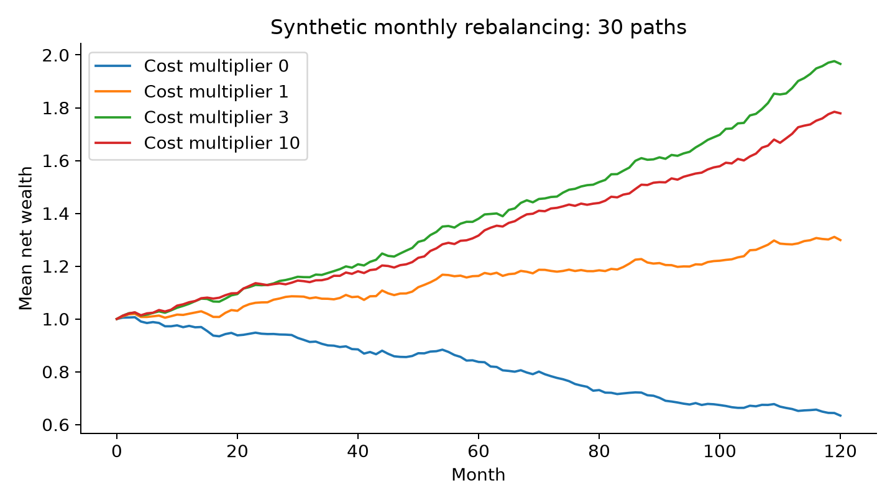
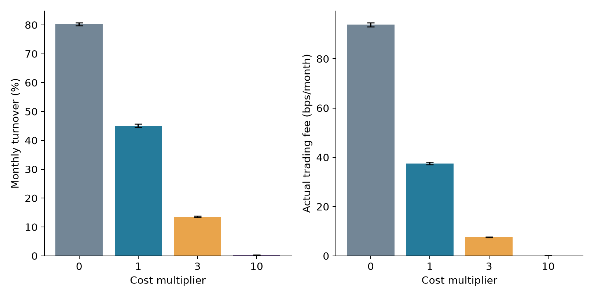

投资组合优化中的交易成本既是收益核算项目，也是决定最优持仓的状态变量。如果先用无摩擦模型产生权重，再在回测末端扣除费用，优化器实际上从未比较一次交易的边际收益与边际成本。对于信号噪声较大、再平衡频繁的组合，这种错位尤其明显。本文从交易前持仓出发，推导比例成本与二次冲击共同作用的凸优化模型，并构造独立的合成实验；主要结论是，成本进入决策会明显降低换手，但成本惩罚越强并不意味着净收益必然越高。

Ledoit 与 Wolf 的 2025 年研究强调，交易费用应在组合选择阶段考虑，而且不同资产的费用可以不同。其发表版本提供了研究这一问题的近期入口，但本文采用更小的合成模型解释数学机制，既不复现论文的证券样本，也不把本文结果视为其经验结论的再验证。[原文及 DOI](https://doi.org/10.1016/j.qref.2025.101962)

这一问题还连接了两类常被分开讨论的研究：统计正则化（regularization）与动态交易控制（dynamic trading control）。二次成本表现为围绕已有持仓的惩罚，与围绕零向量或等权向量的岭惩罚具有不同经济含义。已有持仓来自过去的交易和价格变动，因此，同样的预期收益与协方差输入，在不同账户状态下可以产生不同的最优目标组合。研究价值不仅在于降低费用，更在于解释稳定性、适应速度和资金容量之间的关系。

## 问题设定

考虑每月再平衡的 $N$ 个风险资产。所有收益均为简单收益，所有费用均为当期交易前财富的比例。下表集中定义符号，后文保持一致。

**表 1：模型记号及实验参数。**

| 记号 | 含义 | 本文实验 |
|---|---|---|
| $w$ | 交易后的目标权重 | 非负，合计为 1 |
| $p$ | 交易前、经过价格漂移的权重 | 从上一期持仓更新 |
| $\widehat\mu$ | 预期月收益预测 | 真实条件均值加噪声 |
| $\Sigma$ | 月收益协方差矩阵 | 已知的合成协方差 |
| $\gamma$ | 风险厌恶参数 | 4 |
| $c_i$ | 每单位买入或卖出金额的比例费用 | 0.001 至 0.004 |
| $\kappa$ | 二次冲击系数 | 0.01 |
| $m$ | 优化阶段的成本倍数 | 0、1、3、10 |

定义成本函数 $C(w,p)=\sum_i c_i|w_i-p_i|+\kappa\|w-p\|_2^2/2$。成本感知模型为

$$
\min_{w\geq0,\ \mathbf{1}^{\top}w=1}
-\widehat\mu^{\top}w+\frac{\gamma}{2}w^{\top}\Sigma w+mC(w,p).
\tag{1}
$$

$m=0$ 是忽略交易成本的决策基线；$m=1$ 使用实验设定的真实成本；$m>1$ 是额外保守惩罚，用于展示参数不确定性下的取舍。所有策略结算时均支付同一个真实成本函数 $C$，不能把成本倍数当成策略实际支付的费率。式 (1) 采用加性成本作为净效用的一阶近似；实验财富核算则使用下文的乘法公式，因此没有把近似目标误写成精确的自融资财富模型。

## 方法

### 二次冲击产生什么正则化

暂时取 $c_i=0$，展开式 (1) 的二次项，略去与 $w$ 无关的常数，得到

$$
\frac12w^{\top}(\gamma\Sigma+m\kappa I)w
-(\widehat\mu+m\kappa p)^{\top}w.
\tag{2}
$$

这说明二次冲击同时改变曲率和线性项。若仍用风险厌恶系数 $\gamma$ 表述，可以写为协方差 $\Sigma+(m\kappa/\gamma)I$ 与均值 $\widehat\mu+m\kappa p$ 的组合。只把协方差加上对角矩阵，而忽略均值中的持仓项，并不等价于交易成本模型。$p$ 是上一期投资决策的实际继承状态，惩罚中心随着市场运行而变化，而不是静态的零向量。

在无卖空边界尚未起作用的区域，拉格朗日一阶条件是 $(\gamma\Sigma+m\kappa I)w=\widehat\mu+m\kappa p-\lambda\mathbf1$，其中 $\lambda$ 由预算约束确定。当最小特征值较小时，加入二次项会改善求解的条件数；但其经济效果还取决于 $p$ 是否接近当前合意组合。倘若市场发生结构突变，过大的锚定强度会延缓必要的调整。因此，稳定性与适应性是两个需要共同评价的目标。

比例成本具有另一种作用。对于不在非负边界上的资产，最优性条件为

$$
0\in-\widehat\mu_i+\gamma(\Sigma w)_i
+m\kappa(w_i-p_i)+mc_i\,\partial|w_i-p_i|+\lambda.
\tag{3}
$$

当 $w_i=p_i$ 时，绝对值函数的次梯度是 $[-1,1]$，从而允许一个边际收益区间内保持原持仓。这是局部无交易区间的来源。多个资产受到预算与相关性约束的耦合，不能把式 (3) 简化成彼此独立的阈值交易规则；资产间协方差、非负边界以及预算乘子都会改变阈值的实际位置。

### 正确继承交易前持仓

若上一期目标权重为 $w_{t-1}$、期间实现收益为 $r_t$，则下一次交易前权重为

$$
p_{t,i}=\frac{w_{t-1,i}(1+r_{t,i})}
{1+w_{t-1}^{\top}r_t}.
\tag{4}
$$

直接用 $w_{t-1}$ 代替 $p_t$ 会把价格变化产生的权重漂移遗漏掉，并影响成本、换手与无交易区间的估计。本文假定费用从全部资产按比例支付，目标权重按费用支付后财富定义，因此净收益为 $r^{\mathrm{net}}=(1-C(w,p))(1+w^{\top}r)-1$。该核算约定是一种明确的离散时间简化；精确的证券数量、现金账户和双边成交约束可以作为后续模型扩展。

算法引入辅助变量 $u_i\geq w_i-p_i$、$u_i\geq p_i-w_i$，将绝对值项改写成线性费用 $\sum_i c_i u_i$。得到的目标是凸二次函数、约束为线性关系。脚本使用解析梯度与 SLSQP 求解，每次检查求解状态、预算误差和非负性。没有使用平滑绝对值近似，也没有在求解失败后静默接受一个权重。

```text
对每一条独立合成路径：
  初始化交易前持仓为等权
  在每个月、每一个成本倍数下求解凸交易问题
  使用统一真实费率计算净收益、换手和财富
  根据实现收益更新价格漂移后的持仓
汇总 30 条路径的均值及蒙特卡洛标准误
```

## 数值实验

实验使用合成数据，包含 8 个资产、120 个月和 30 条独立路径。第 $i$ 个资产的月标准差在线性网格 0.035 至 0.060 上，任意两资产的相关系数为 0.25。条件均值为 $0.004+a_{t,i}$，其中 $a_{t,i}=0.97a_{t-1,i}+\epsilon_{t,i}$，$\epsilon_{t,i}$ 独立服从标准差 0.0009 的正态分布，初始值为零。给定条件均值后，实现收益具有上述已知协方差；预测额外加入标准差 0.009 的独立正态误差。

协方差取真值，是为了把问题集中在均值信号噪声与交易费用的交互上。因此，本实验不能说明某一种协方差估计器更好。每条路径中，所有策略共享条件均值、预测误差和收益冲击，以减少比较的随机波动；不同路径使用主种子 20261005 加上路径编号。120 个月仅表示合成实验长度，不对应任何真实历史时期。

**表 2：统一真实成本下的合成结果，括号为 30 条路径的蒙特卡洛标准误。**

| 成本倍数 | 年化算术净收益 (%) | 年化波动 (%) | 净夏普比率 | 月换手 (%) | 月费用 (基点) |
|---|---:|---:|---:|---:|---:|
| 0 | -4.21 (0.68) | 14.11 (0.22) | -0.303 (0.048) | 80.28 (0.53) | 93.84 (0.87) |
| 1 | 2.91 (0.55) | 12.25 (0.16) | 0.240 (0.044) | 45.07 (0.58) | 37.54 (0.57) |
| 3 | 6.75 (0.66) | 11.10 (0.16) | 0.618 (0.061) | 13.53 (0.27) | 7.61 (0.17) |
| 10 | 5.76 (0.57) | 9.70 (0.14) | 0.600 (0.059) | 0.27 (0.02) | 0.09 (0.01) |

年化算术净收益为 $12\bar r^{\mathrm{net}}$，年化波动为 $\sqrt{12}s$，夏普比率为 $\sqrt{12}\bar r^{\mathrm{net}}/s$，无风险利率设为零；这不是复合年增长率。月换手采用 $\|w-p\|_1/2$，费用采用双边成交金额的真实成本函数，因此不能用表中月换手直接乘单边费率推导全部费用。标准误反映所选数据生成机制下的模拟误差，不代表真实市场参数的不确定性。



图 1：各曲线为合成数据的平均净财富，不是某一真实基金的收益轨迹；图中均值与表中算术收益属于不同汇总量。



图 2：合成数据的交易强度与费用比较；惩罚倍数只作用于优化目标，费用柱始终来自统一的真实成本。

本实验最稳定的机制性发现是成本惩罚对交易量的抑制。由于预测信号包含较强噪声，无摩擦优化容易追逐暂时性的均值变化。费用模型不仅减少显性的交易支出，也会过滤部分预测噪声。两种作用在此共同发生，不能根据净收益改善直接声称预测模型变得更准确。

另一方面，较强惩罚可以产生更小的费用，却无法保证更优的净效用。随着 $m$ 上升，策略逐渐继承更多已有持仓，错失条件均值缓慢变化带来的调整机会。这里的四个倍数用于敏感性展示，均未通过测试路径进行最优选择；若实际研究需要选取惩罚强度，应设置独立验证区间，并在未参与选择的数据上报告最终表现。

可研究的第一个方向是资产异质性与资金容量：将 $\kappa I$ 替换为依赖成交额、波动和资金规模的半正定冲击矩阵，分析集中交易导致的交叉冲击。第二个方向是成本估计不确定性：对 $c$ 与冲击矩阵建立不确定集合，推导成本鲁棒的无交易区域，并研究是否能避免统一放大所有费用造成的过度保守。第三个方向是带状态转移的多期优化：把未来价格漂移、机会成本和终端清算纳入动态规划，比较局部交易阈值与跨期最优阈值的差异。这些属于研究建议，本文未证明其优越性。

## 结论与展望

交易成本改变了优化问题本身，其作用不能由回测后的费用扣减完整替代。二次冲击对应围绕交易前持仓的锚定，同时改变曲率与线性项；比例成本则产生依赖整体约束的无交易区间。合成结果揭示了降低换手与保持适应速度之间的权衡，尚不足以推出真实市场中的最优惩罚倍数。后续应使用独立市场样本、资产异质费率与容量约束，检验成本鲁棒模型在结构变化期间的净效用表现。

## 复现说明

在本目录运行 `python reproduce.py`，依赖 NumPy、SciPy、pandas 与 Matplotlib。主种子为 20261005，路径种子为主种子加路径编号。脚本生成 `results.csv`、`results.json`、`wealth.csv`、`fig1.png` 和 `fig2.png`；所有表格数字来自 `results.json`，图字段见 `figures-list.md`。成本优化失败会立即报错。计算与文献检索截至 2026-10-05，本文为研究推文草稿，包含新构造的教学实验，不是所引论文的完整复现。

## 参考文献

1. Ledoit, O., & Wolf, M. (2025). Markowitz portfolios under transaction costs. *The Quarterly Review of Economics and Finance*, 100, 101962. 已发表。[DOI](https://doi.org/10.1016/j.qref.2025.101962)；[作者机构提供的全文](https://www.econ.uzh.ch/dam/jcr:cd9c657f-16d3-4155-872d-e5ebae7557ac/qref_2025.pdf)。
