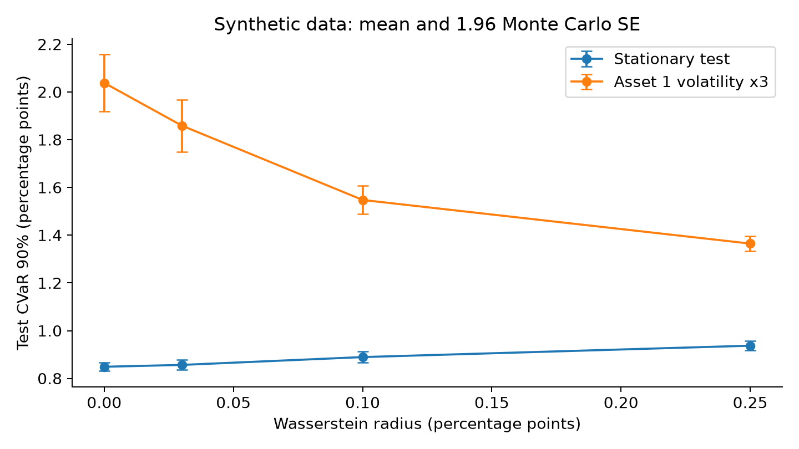
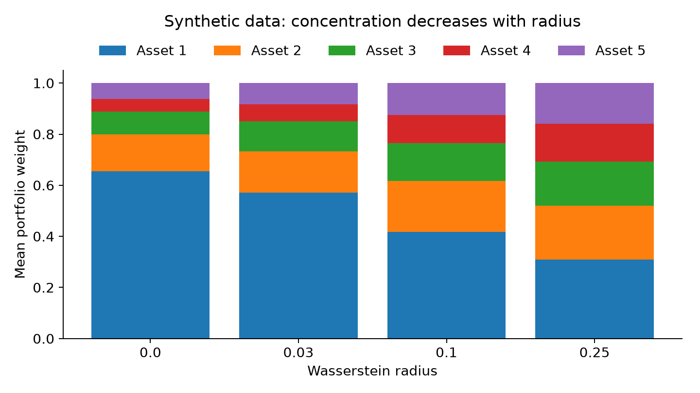

有限样本下的投资组合优化，困难往往来自未来收益分布与历史经验分布之间的差异。分布鲁棒优化（distributionally robust optimization, DRO）允许决策者在一组可能的分布中评估最坏损失，因而同时涉及统计估计与凸优化。本文围绕 Wasserstein 模糊集和条件风险价值（conditional value-at-risk, CVaR）展开数学解释，并设计一个包含波动结构变化的合成实验；主要结论是，扩大模糊集可以缓解特定分布变化下的尾部风险，但代价体现为稳定环境中的风险效率下降，半径的选择必须服从可检验的统计目标。

Wasserstein 距离把“分布差异”解释为搬运概率质量的成本。对研究者而言，它的吸引力并非一个抽象的安全标签，而是某些无限维最坏分布问题能够转化为有限维凸问题。Mohajerin Esfahani 与 Kuhn 的基础工作系统给出相应重构与性能保证；这些保证依赖支持集、尾部条件和模糊半径的构造，不能无条件套用到任何金融时间序列。[原始论文](https://doi.org/10.1007/s10107-017-1172-1)

截至 2026 年 10 月 5 日检索到的近期研究，进一步把模糊集中心、半径乃至地面度量与市场状态联系起来。Guo 于 2026 年 7 月提交的预印本提出学习预测模糊集，让决策损失参与校准过程。这里把它视为正在发展的建模思路：预测残差的条件覆盖、未知分布落入 Wasserstein 球的概率，以及最终组合损失的控制，是三个需要分别验证的命题。[预印本原文](https://arxiv.org/abs/2607.09820)

本文的实验使用固定半径和低维凸模型，不实现上述神经网络模型，也不复现任何论文的真实资产回测。这样一个小型实验能够明确展示正则化项如何改变持仓，以及指标改善究竟来自哪种分布变化。后续研究的价值应体现在能够证明的覆盖性质、决策误差界和稳定算法，而不能仅凭一次测试中的最好收益作判断。

## 问题设定

记 $r\in\mathbb{R}^p$ 为一期收益向量，$w$ 为组合权重，$\ell_w(r)=-w^\top r$ 为损失。本节收益统一使用“日收益百分点”：数值 $1$ 表示 $1\%$。经验分布为 $\widehat P_n=n^{-1}\sum_{i=1}^n\delta_{r_i}$，可行集为 $\Delta_p=\{w\geq0:\mathbf1^\top w=1\}$。符号及其功能如下。

| 符号 | 含义 |
|---|---|
| $\alpha$ | CVaR 置信水平，本实验取 $0.90$ |
| $\varepsilon$ | Wasserstein 半径，与收益使用相同单位 |
| $t$ | CVaR 变分表达中的损失阈值 |
| $\|\cdot\|_*$ | 地面范数的对偶范数 |

在有限一阶矩的分布上，定义一阶 Wasserstein 球 $\mathcal P_\varepsilon=\{Q:W_1(Q,\widehat P_n)\leq\varepsilon\}$，地面距离先取欧氏范数。对可积损失，CVaR 使用适用于一般分布的变分定义：

$$
\operatorname{CVaR}_\alpha^Q(\ell_w)
=\inf_{t\in\mathbb R}\left\{t+\frac{\mathbb E_Q[(\ell_w-t)_+]}{1-\alpha}\right\}.
\tag{1}
$$

该定义不要求损失分布连续。真正的最坏 CVaR 是 $\sup_{Q\in\mathcal P_\varepsilon}\inf_t F_Q(w,t)$。下文求解的 $\inf_t\sup_Q F_Q(w,t)$ 始终是它的上界；在尚未验证极小极大交换条件时，二者不能直接等同。这一区别决定了一个数值模型能否被准确称为最坏 CVaR 的精确重构。

## 方法

对固定 $w,t$，取 $h(r)=(-w^\top r-t)_+/(1-\alpha)$。若支持集为整个 $\mathbb R^p$、地面成本为范数且采用一阶 Wasserstein 距离，则该连续、至多线性增长的函数满足 Wasserstein 对偶的适用条件。其对偶表达为

$$
\sup_{Q\in\mathcal P_\varepsilon}\mathbb E_Q[h(r)]
=\inf_{\lambda\geq0}\left\{\lambda\varepsilon+\frac1n\sum_{i=1}^n\sup_{r\in\mathbb R^p}\big[h(r)-\lambda\|r-r_i\|\big]\right\}.
\tag{2}
$$

这里 $h$ 的 Lipschitz 常数为 $\|w\|_* /(1-\alpha)$。当 $\lambda$ 小于该值时，可以沿损失增加的方向把 $r$ 推向无穷，内层上确界变为无穷；当 $\lambda$ 达到该值时，Lipschitz 不等式给出上界，取 $r=r_i$ 达到内层上界。因此固定阈值的最坏期望等于经验期望加 $\varepsilon\|w\|_* /(1-\alpha)$。这个推导依赖无界支持集；若加入有界收益支持、非欧氏成本或二阶 Wasserstein 距离，需要重新推导，不能保留惩罚项不变。

为观察风险与持仓的关系，实验求解一个保守风险上界加经验收益奖励的模型：

$$
\min_{w\in\Delta_p,\ t\in\mathbb R}
t+\frac{\sum_{i=1}^n(-w^\top r_i-t)_+}{n(1-\alpha)}
 +\frac{\varepsilon}{1-\alpha}\|w\|_2-0.2\widehat\mu^\top w.
\tag{3}
$$

收益奖励使用经验均值 $\widehat\mu$，没有对均值项再次取最坏分布，所以式 (3) 的准确名称是“鲁棒尾部风险上界加经验收益”。它不是对完整均值—CVaR 损失同时进行 DRO 的模型。研究写作中应标清这一边界，避免把一个惩罚模型描述成更强的鲁棒保证。

引入辅助变量 $u_i\geq0$、$u_i\geq-w^\top r_i-t$ 后，经验 CVaR 部分为线性规划，欧氏惩罚保持凸性。脚本先求无惩罚线性规划，再以其结果初始化顺序二次规划；记录并检查求解成功、预算误差与非负约束。简化算法如下。

```text
对每次独立实验：
    生成训练样本与两个独立测试样本
    求解经验 CVaR 的线性规划
    对预先指定的每个半径求解凸惩罚模型
    在相同测试样本上计算 CVaR、收益和权重集中度
汇总重复实验的均值与 Monte Carlo 标准误
```

欧氏惩罚通过降低 $\|w\|_2$ 鼓励分散，并不等于限制持仓数量。特别地，在多头单纯形上 $\|w\|_1=1$，添加 $\ell_1$ 惩罚只会增加常数，不能产生稀疏组合。半径也不能仅凭收益最大化来选择：若声称统计覆盖，则应给出覆盖水平、数据条件和校准方法；若仅进行验证集选择，则应把它称为经验风险调参。

在形成研究课题时，可以先规定一个比“所有市场状态都鲁棒”更明确的数学目标。例如给定状态变量 $x$，希望以指定置信水平控制条件分布 $P(\cdot\mid x)$ 与预测中心 $\widehat P_x$ 的 Wasserstein 距离。需要分别处理中心预测误差、有限情景离散化误差与半径估计误差；即使单个收益落在预测区间内，也不能说明整个条件分布接近预测中心。对于连续状态，校准样本如何在不同状态之间共享信息，构成统计层面的主要困难。

另一个可实施问题是半径扰动对组合的影响。式 (3) 的惩罚系数含有 $1/(1-\alpha)$，同样的半径在更高置信水平下被放大。因而比较两个模型时，应同时报告置信水平和半径单位；只有半径数值而没有收益尺度，实验无法解释。若进一步添加严格凸二次持仓惩罚，可以尝试从目标函数的强凸性建立半径变化导致的权重变化界，再将该界用于在线半径更新的换手控制；这里给出的是证明路线，尚未给出定理。

在实证设计上，半径校准与策略评估也应分开。可先在训练窗口估计中心，用下一段数据评估覆盖或选择半径，再在最终窗口评价组合损失；时间序列中这些窗口必须保留顺序。为了比较统计覆盖与经济效果，未来实验可同时记录模糊集失覆盖次数、真实损失超过风险上界的次数、换手率和净成本。它们对应不同的失败事件，不能用其中某一项替代全部验证。

## 数值实验

使用 $p=5$ 个合成资产，每次训练 $n=100$，两个测试集各有 $4000$ 个独立观测，共重复 $24$ 次。均值向量为 $(0.060,0.045,0.030,0.025,0.020)$，波动参数为 $(0.55,0.85,1,1.15,1.30)$，相关矩阵非对角元素为 $0.20$。训练与稳定测试来自自由度为 $5$ 的多元 Student 分布，并乘以 $\sqrt{3/5}$ 使协方差等于指定矩阵；压力测试把第一个资产的中心化随机收益乘以 $3$，均值不变。半径预先指定为 $0,0.03,0.10,0.25$，没有使用压力测试结果选取参数。

**表 1：合成数据下的测试 CVaR、稳定测试均值与集中度，24 次重复的均值；CVaR 和均值单位为日收益百分点**

| 方法 | 稳定 CVaR90 | 压力 CVaR90 | 稳定均值 | $\sum_jw_j^2$ |
|---|---:|---:|---:|---:|
| 等权 | 1.02325 | 1.24066 | 0.03397 | 0.20000 |
| $\varepsilon=0$ | 0.84877 | 2.03802 | 0.04997 | 0.50236 |
| $\varepsilon=0.03$ | 0.85654 | 1.85922 | 0.04710 | 0.41559 |
| $\varepsilon=0.10$ | 0.88934 | 1.54759 | 0.04211 | 0.28504 |
| $\varepsilon=0.25$ | 0.93707 | 1.36479 | 0.03820 | 0.22490 |



图 1：合成数据中两种测试环境的 CVaR90，误差棒为重复实验均值的 $1.96$ 倍 Monte Carlo 标准误，并非单日风险预测区间。



图 2：合成数据中各资产平均权重的堆叠图，24 次重复，半径增大时持仓趋于分散。

压力 CVaR 随半径增大由 $2.03802$ 降至 $1.36479$，相应稳定 CVaR 从 $0.84877$ 升至 $0.93707$。这是一次可见的保守性代价：模型降低了对训练期低波动资产的依赖，却减少了稳定分布中的优化优势。等权在本压力场景中仍具有更低 CVaR，因此实验并不支持“鲁棒模型总优于简单基线”。半径为 $0.25$ 时，压力 CVaR 均值标准误为 $0.01555$；这些有限次实验误差也不足以推出任意分布变化的保证。

值得进一步研究的是变化方向与地面度量之间的关系。本实验的欧氏成本对所有资产统一计价，而压力变化主要集中于一个资产；若经济上合理的风险方向已知，状态依赖度量可能提高效率。不过，用未来压力信息构造度量会造成信息泄漏，应该通过训练时可获得的状态变量构造并独立评估。

## 结论与展望

第一，固定阈值 Wasserstein 对偶与最坏 CVaR 的极小极大交换属于不同数学步骤，完整研究应分别证明。第二，可从条件模糊集入手，研究残差预测集的覆盖如何转化为分布覆盖或直接决策风险界；没有这一步，学习半径主要是经验校准工具。第三，可研究时间依赖收益下的分块校准、各向异性搬运成本，以及半径更新与换手成本的共同稳定性。第四，本文只是机制演示，未给出新定理；可实施的后续课题是先在有界支持与有限状态模型中建立覆盖和稳定性结果，再扩展到厚尾收益。

## 复现说明

运行 `python reproduce.py`，脚本需 NumPy、SciPy、pandas 和 Matplotlib，随机种子为 `202610051`。脚本输出 `replicates.csv`、`weights.csv`、`results.json` 与两张 PNG；结果文件保存单位、样本量、参数及所有汇总标准误。测试 CVaR 使用式 (1) 的经验分布表达，计算阈值采用样本分位数。表中数字来自实际运行，图件字段说明见同目录 `figures-list.md`。不同库版本可能产生求解末位差异，不影响本实验所呈现的机制边界。

## 参考文献

1. Rockafellar, R. T., & Uryasev, S. (2000). Optimization of conditional value-at-risk. *Journal of Risk*, 2(3), 21–41. [DOI](https://doi.org/10.21314/JOR.2000.038).
2. Mohajerin Esfahani, P., & Kuhn, D. (2018). Data-driven distributionally robust optimization using the Wasserstein metric: performance guarantees and tractable reformulations. *Mathematical Programming*, 171, 115–166. 正式发表。[DOI](https://doi.org/10.1007/s10107-017-1172-1).
3. Guo, J. (2026). Learning Predictive Ambiguity Sets for Decision-Focused Distributionally Robust Optimization. arXiv:2607.09820，2026-07-10 提交；预印本，本文不将其视为已同行评审的结论。[原文](https://arxiv.org/abs/2607.09820).
